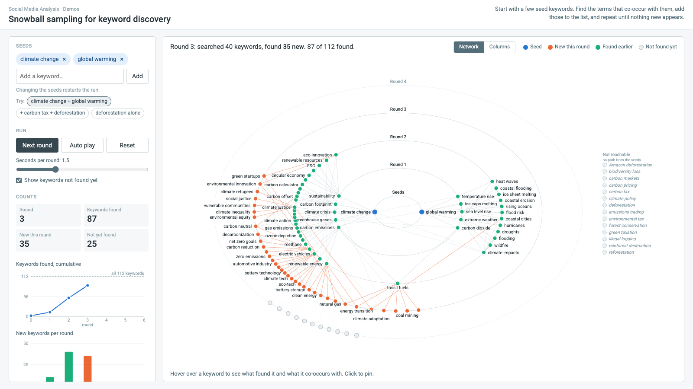

# Demos

Interactive pages that each show one idea from the course. They run in the browser and need no setup.

## Snowball sampling for keyword discovery

**[Open the demo](snowball-sampling/index.html)**

Keyword-based data collection starts from a list of search terms, and the list is rarely complete on the first try. Snowball sampling grows it: start with a few seed keywords, find the terms that co-occur with them in posts, add those to the list, and repeat until a round finds nothing new.

The demo runs this search one round at a time over a network of 112 climate-related keywords. Each round it shows which keywords were found and by searching what, how the total grows and then saturates, and which keywords the seeds can never reach. Things to try:

- Press **Next round** until the search saturates. With the default seeds it stops at 98 of 112 keywords; the 14 in the "Not reachable" block are the carbon-tax and deforestation vocabularies, which nothing in the found set co-occurs with.
- Use the **Try:** presets. Adding `carbon tax` and `deforestation` as seeds reaches all 112; `deforestation` alone reaches 7.
- Hover over a keyword to see what found it and what it co-occurs with. Click to pin.
- Switch between the **Network** view (rings by round) and the **Columns** view (a readable list per round).
- The right arrow key or a presentation clicker also advances a round.

The keyword network is made up for teaching; it was not measured from real posts. The search is deterministic: each round looks up the keywords found in the previous round and adds every term that co-occurs with them.
