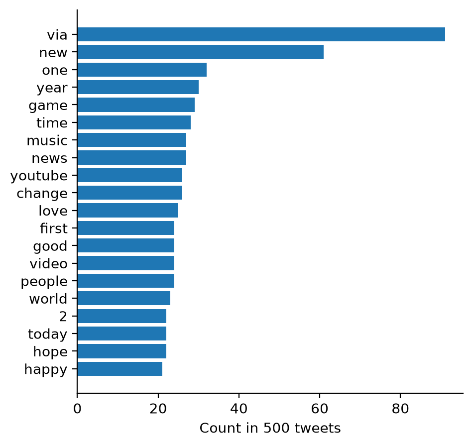

# Bag of words and TF-IDF

A bag of words describes a document by the words in it and by how often each word appears.
It ignores grammar and word order.
A document can be one post, or all the posts of one account, one community, or one day joined together.

The units that are counted are called tokens.
A unigram is a single word, such as `intelligence`.
A bigram is a pair of consecutive words, such as `artificial intelligence`.
The step that splits a text into tokens is called tokenization.

The [Word Counts notebook](word-counts.ipynb) runs all the code on this page.

## When to use it

Use word counts for a first look at a collection of posts.
The method is fast, and it needs no data other than your own posts.
Every number can be traced back to words that you can read.

A bag of words knows nothing about meaning or word order.
`movie` and `film` are two unrelated words to it.
The posts "dog bites man" and "man bites dog" have the same word counts.
When the meaning of the words matters, use a [word embedding](word-embedding.md).

## Tokenizing

A general tokenizer, such as `word_tokenize` from [NLTK](https://www.nltk.org/), was built for edited text, such as news articles.
The post below is hand-written.

```python
from nltk.tokenize import word_tokenize

s = "@alice this class is soooooo cool!!! :-) #datascience https://example.com"
print(word_tokenize(s))
```

```text
['@', 'alice', 'this', 'class', 'is', 'soooooo', 'cool', '!', '!', '!', ':', '-', ')', '#', 'datascience', 'https', ':', '//example.com']
```

The mention, the emoticon, the hashtag, and the link are each split into pieces.
[`TweetTokenizer`](https://www.nltk.org/api/nltk.tokenize.casual.html) from NLTK was written for social media posts, and it keeps each of them in one piece.

```python
from nltk.tokenize import TweetTokenizer

print(TweetTokenizer().tokenize(s))
```

Three options change the result.
`preserve_case=False` lowercases the text.
`reduce_len=True` shortens a letter that repeats more than three times to three letters.
`strip_handles=True` removes mentions.

```python
tokenizer = TweetTokenizer(preserve_case=False, reduce_len=True, strip_handles=True)

tokens = tokenizer.tokenize(s)
print(tokens)
```

```text
['this', 'class', 'is', 'sooo', 'cool', '!', '!', '!', ':-)', '#datascience', 'https://example.com']
```

## Normalizing and removing stopwords

Counting works on normalized tokens.
Without normalization, `Cool` and `cool` count as two different words.
Stopwords are very frequent words that carry little meaning on their own, such as `the`, `is`, and `to`.
NLTK has a list of English stopwords, with 198 words.

```python
from nltk.corpus import stopwords

stop_words = set(stopwords.words("english"))
```

The function below drops a token in three cases: the token is a link, the token has no letter and no digit, or the token is a stopword.

```python
def normalize(tokens, remove_stopwords=True):
    kept = []
    for token in tokens:
        if token.startswith("http"):
            continue
        if not any(ch.isalnum() for ch in token):
            continue
        if remove_stopwords and token in stop_words:
            continue
        kept.append(token)
    return kept
```

For the example post, `normalize(tokens)` returns four tokens: `class`, `sooo`, `cool`, and `#datascience`.

Each of these steps is a choice, and each one can be wrong for a given question.
A study of pronouns must keep the stopwords, because `i`, `we`, and `they` are in the list.
A study of emotion must keep the emoticons and the emoji.
Look at what a step removes before you apply it to all of your posts.

## Counting words

The function `tokenize` runs three steps in order: clean the text, tokenize it, and normalize the tokens.

```python
def tokenize(text, remove_stopwords=True):
    return normalize(tokenizer.tokenize(clean_text(text)), remove_stopwords)
```

`clean_text` is a function of the notebook that prepares the text for the tokenizer.
The sample data of the notebook has placeholders such as `{{URL}}` in place of links and account names, and `clean_text` removes them.
Write a `clean_text` that fits your own data.

`collections.Counter` counts the tokens.
In the code below, `df` is a pandas table with one post in each row and the text of the post in the column `text`.

```python
from collections import Counter

sample = df.sample(500, random_state=42)

counts = Counter()
for text in sample["text"]:
    counts.update(tokenize(text))

print(sum(counts.values()), "tokens,", len(counts), "different words")
counts.most_common(20)
```

The sample data of the notebook is TweetTopic, a research dataset of 6,090 English tweets.
The 500 tweets of the sample have 8,270 tokens and 4,210 different words.
Most words are rare: 2,975 of the 4,210 words, or 71%, appear only once.
A word that appears once or twice says little about the collection, so an analysis usually keeps only the words above a minimum count.
Only 304 words of this sample appear 5 times or more.

## Plotting the top words

A bar plot shows the counts of the top words.
The bars are horizontal, so the words are easy to read.
In the code, `pd` is pandas.

```python
import matplotlib.pyplot as plt

top = pd.DataFrame(counts.most_common(20), columns=["word", "count"])

fig, ax = plt.subplots(figsize=(5, 5))
ax.barh(top["word"], top["count"])
ax.invert_yaxis()
ax.set_xlabel("Count in 500 tweets")
ax.spines[["top", "right"]].set_visible(False)
plt.show()
```

{ width="420" }

The most frequent word is `via`.
In this dataset it is almost always followed by the name of an account, as in the text that the share button of a website writes.
A word like this is frequent because of how the posts were made, not because of what they say.

A word cloud shows the same counts as font sizes, and it is harder to read than the bar plot.
A reader cannot compare two font sizes exactly, a long word looks larger than a short word with the same count, and the position of a word means nothing.
If you need a word cloud, the [`wordcloud`](https://github.com/amueller/word_cloud) package draws one from the same counts.

## TF-IDF

Raw counts favor the words that are frequent everywhere.
TF-IDF (term frequency–inverse document frequency) reweights the count of a word in a document by the number of documents that contain the word.

$$
\mathrm{tf}(t, d) = \frac{f_{t,d}}{\sum_{t' \in d} f_{t',d}}
\qquad
\mathrm{idf}(t) = \ln \frac{N}{n_t}
$$

- $f_{t,d}$ is the count of term $t$ in document $d$.
- The sum under the line adds the counts of all terms $t'$ in document $d$. It is the number of tokens in the document.
- $N$ is the number of documents, and $n_t$ is the number of documents that contain term $t$.
- $\ln$ is the natural logarithm.

The TF-IDF score of term $t$ in document $d$ is $\mathrm{tf}(t, d) \times \mathrm{idf}(t)$.

The three documents below are hand-written.

```python
docs = {
    "A": "the game was great and the team played great",
    "B": "the election was close and the vote count is not final",
    "C": "the new phone is out and the camera is great",
}
```

| Document | Top words by raw count | Top words by TF-IDF |
|----------|------------------------|---------------------|
| A | the (2), great (2) | game, team, played (0.122 each) |
| B | the (2) | election, close, vote, count, not, final (0.100 each) |
| C | the (2), is (2) | new, phone, out, camera (0.110 each) |

- `the` and `and` are in all three documents, so their idf is $\ln(3/3) = 0$ and their score is 0. No stopword list was needed to remove them.
- `great` is down-weighted, not removed. It is in two documents, so its idf is $\ln(3/2) = 0.41$. Its score in A is 0.090, below the score of `game`, which appears once.
- TF-IDF knows only that a word is rare. It does not know that a word is meaningful. In B, `not` scores as high as `election`.

The notebook computes these numbers step by step in the section [TF-IDF by hand](word-counts.ipynb#tf-idf-by-hand).

## TF-IDF with scikit-learn

[`TfidfVectorizer`](https://scikit-learn.org/stable/modules/generated/sklearn.feature_extraction.text.TfidfVectorizer.html) from scikit-learn does the tokenizing, the counting, and the weighting in one call.
It returns a matrix with one row for each document and one column for each word.

```python
from sklearn.feature_extraction.text import TfidfVectorizer

vectorizer = TfidfVectorizer()
matrix = vectorizer.fit_transform(docs.values())
```

The numbers are not the numbers of the table above, because scikit-learn uses other formulas by default.

- Its idf is $\ln \frac{1 + N}{1 + n_t} + 1$. This value is never below 1, so a word that is in every document keeps a weight.
- Its tf is the raw count $f_{t,d}$, not the count divided by the length of the document.
- It then scales each row so that the squares of its values sum to 1.

With these defaults, `the` has the second highest score in document A.
The scores of scikit-learn do not remove stopwords for you.
When you report TF-IDF scores, say which formula you used.

Two more points apply to social media posts.

- `TfidfVectorizer(analyzer=tokenize)` calls the `tokenize` function from above in place of the tokenizer of scikit-learn.
- One post is too short to be a useful document. Join the posts of each group into one long document first.

## Links

- [Word Counts notebook](word-counts.ipynb): all the code on this page
- [NLTK](https://www.nltk.org/) and [spaCy](https://spacy.io/): two libraries with tokenizers
- [An older copy of the NLTK English stopword list](https://gist.github.com/sebleier/554280), to read in a browser
- [`collections.Counter`](https://docs.python.org/3/library/collections.html#collections.Counter) in the Python documentation
- Antypas et al. (2022), [Twitter Topic Classification](https://arxiv.org/abs/2209.09824): the paper of the TweetTopic dataset

Next: [Comparing corpora](comparing-corpora.md) finds the words that one group of posts uses more than another group.
