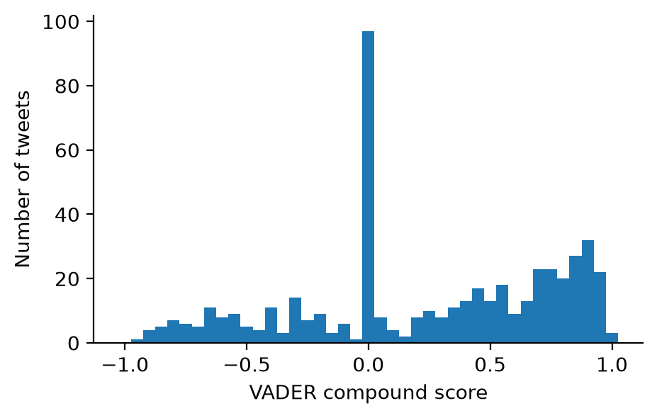

# Dictionary-based analysis

A dictionary is a list of words in which each word has a score.
A dictionary method scores a post in two steps.
It looks up the words of the post in the list, and it combines the scores of the words that it finds.
Another name for such a list is a lexicon.

This page shows two dictionaries: VADER for sentiment and the eMFD for moral foundations.

The [Scoring Text notebook](scoring-text.ipynb) runs all the code on this page.

## When to use it

Use a dictionary when one exists for the concept that you want to measure.
The method is fast, it costs nothing, and it runs on your own machine.
Every score can be traced back to the words that produced it.

A dictionary counts words, and it does not understand the text.
It misses sarcasm, and it handles negation only by simple rules.
It knows only the words in its list, with the meaning that they had when the list was made.
The score of one short post depends on very few words, so use a dictionary to compare groups of many posts.
When the meaning of the whole sentence matters, use a [classifier](classifiers.md).

## Sentiment with VADER

[VADER](https://github.com/cjhutto/vaderSentiment) (Valence Aware Dictionary and sEntiment Reasoner) is a sentiment tool that was built for social media text.
It has two parts: a lexicon and a few rules.

The lexicon gives a score to each of its entries.
An entry is a word, an emoticon, or an abbreviation.
The score goes from -4 for the most negative entries to 4 for the most positive ones.
Each score is the mean rating of ten people.

```python
from vaderSentiment.vaderSentiment import SentimentIntensityAnalyzer

analyzer = SentimentIntensityAnalyzer()
print(len(analyzer.lexicon), "entries in the lexicon")

for entry in ["happy", "good", "harassment", "lol", ":)", "table"]:
    print(entry, analyzer.lexicon.get(entry))
```

The lexicon has 7,506 entries.
The score of `happy` is 2.7, the score of `good` is 1.9, and the score of `harassment` is -2.5.
The abbreviation `lol` and the emoticon `:)` have scores too.
`table` is not in the lexicon, and VADER treats a word without a score as neutral.

`polarity_scores` scores a text and returns four numbers.
`neg`, `neu`, and `pos` are the shares of the text that are negative, neutral, and positive.
`compound` is one summary score between -1 (most negative) and 1 (most positive).
VADER adds the scores of the lexicon words, after the rules have changed them, and scales the sum to this range.
Most analyses use `compound`.

The rules change the score of a lexicon word according to the words and the punctuation around it.
The three sentences below are hand-written, and all three contain the lexicon word `good`.

```python
sentences = [
    "The food is good.",
    "The food is GOOD!!!",
    "The food is not good.",
]

for sentence in sentences:
    print(analyzer.polarity_scores(sentence)["compound"], sentence)
```

The compound scores are 0.44, 0.67, and -0.34.
Capital letters and exclamation marks raise the score.
The word `not` before `good` turns the score negative.

To turn the compound score into a label, the documentation of VADER gives the typical cutoffs.
A text is positive at 0.05 or above, negative at -0.05 or below, and neutral in between.
These cutoffs are a convention.
The section [From scores to labels](classifiers.md#from-scores-to-labels) shows how the counts change with the cutoff.

## Where VADER fails

The rules are simple patterns, and VADER does not understand the sentence.
The six sentences below are hand-written, and a person reads each of them without difficulty.

```python
hard_sentences = [
    "Great, the bus is late again.",
    "I love waiting two hours for a late bus.",
    "The service was anything but good.",
    "The new album is fire.",
    "The defense killed it tonight.",
    "This song is a banger.",
]

for sentence in hard_sentences:
    print(analyzer.polarity_scores(sentence)["compound"], sentence)
```

| Sentence | Compound score | A person reads it as |
|----------|:--------------:|----------------------|
| Great, the bus is late again. | 0.62 | Negative |
| I love waiting two hours for a late bus. | 0.64 | Negative |
| The service was anything but good. | 0.59 | Negative |
| The new album is fire. | -0.34 | Positive |
| The defense killed it tonight. | -0.61 | Positive |
| This song is a banger. | 0.00 | Positive |

VADER gets all six wrong.

- The first two sentences are sarcastic. VADER finds `great` and `love` and returns a positive score.
- `anything but good` is a negation that the rules do not cover.
- `fire` and `killed` are praise in these sentences. The lexicon has only their literal, negative meaning.
- `banger` is not in the lexicon, so the score is 0.

## Scoring a table of posts

Scoring a table is one call for each row.
In the code below, `sample` is a pandas table of 500 tweets, and its column `clean` holds the cleaned text of each tweet.
The sample data of the notebook is TweetTopic, a research dataset of 6,090 English tweets with topic labels.
VADER is fast: 500 tweets take well under a second.

```python
sample["vader"] = [analyzer.polarity_scores(text)["compound"] for text in sample["clean"]]

sample["vader"].describe().round(3)
```

{ width="420" }

In the notebook, the median score of the 500 tweets is 0.29, so more tweets are positive than negative.
The histogram has a tall bar at 0: 97 of the 500 tweets have a score of exactly 0.
Almost all of these tweets contain no lexicon word.
A score of 0 from a dictionary means "no evidence".
It does not mean that a person would call the post neutral.

A common use of a dictionary score is to compare groups of posts.
The score of one post is noisy, and the mean over many posts is more stable, if the errors do not all go in the same direction.
The notebook compares the topic labels that have 30 tweets or more.
The news tweets have the lowest mean score, 0.09, and the tweets about arts and culture have the highest, 0.48.
Before you report a difference between groups, read a sample of posts from each group with their scores.

## Moral foundations with eMFD

A dictionary can measure other concepts than sentiment.
Moral foundations theory describes moral reasoning with a short list of foundations: care, fairness, loyalty, authority, sanctity, and, in later versions, liberty.
The extended Moral Foundations Dictionary (eMFD; [Hopp et al., 2021](https://doi.org/10.3758/s13428-020-01433-0)) covers the first five.

Its authors asked a large group of people to read news articles and to highlight the passages that relate to one foundation.
The dictionary has 3,270 words from these highlights.
For each word and each foundation, it has two numbers.

- A probability, in the columns that end with `_p`. `care_p` says how often a reader who looked for care highlighted a passage with this word, out of the times that such a reader saw the word.
- A sentiment score, in the columns that end with `_sent`. `care_sent` is the mean VADER compound score of the care passages that contain the word.

The notebook downloads the dictionary file (0.6 MB) from the repository of [eMFDscore](https://github.com/medianeuroscience/emfdscore), the scoring tool of the same authors.
That repository states the GNU GPL 3.0 license for non-commercial use.
The long string in the address is a fixed commit, so every run gets the same file.
The code needs the modules `pathlib` and `urllib.request`, and pandas as `pd`.

```python
emfd_url = (
    "https://raw.githubusercontent.com/medianeuroscience/emfdscore/"
    "5523d76c25afa65a59ca00e44efe45885499b116/"
    "emfdscore/dictionaries/emfd_scoring.csv"
)
emfd_path = pathlib.Path("data") / "emfd_scoring.csv"
if not emfd_path.exists():
    urllib.request.urlretrieve(emfd_url, emfd_path)

emfd = pd.read_csv(emfd_path, keep_default_na=False).set_index("word")
```

No word belongs to one foundation only.
`killed` has its highest probability for care, 0.46, and its other four probabilities are between 0.13 and 0.18.
`unfair` has its highest probability for fairness, 0.34, and `flag` for authority, 0.42.
This is the main difference from VADER, where each word has one score.

To score a post, `emfd_scores` takes the words of the post that are in the dictionary and averages their rows.
The scoring tool of the authors does the same.
The function uses `tokenize` from the [bag of words page](bag-of-words.md#counting-words).
The three posts are hand-written.

```python
def emfd_scores(text):
    words = [token.lstrip("#") for token in tokenize(text)]
    words = [word for word in words if word in emfd.index]
    if words:
        scores = emfd.loc[words].mean()
    else:
        scores = pd.Series(0.0, index=emfd.columns)
    scores["n_words"] = len(words)
    return scores


posts = {
    "A": "The soldiers killed two people in the attack.",
    "B": "It is unfair that the workers do not get fair pay.",
    "C": "The team killed it tonight, what a game!",
}

prob_columns = ["care_p", "fairness_p", "loyalty_p", "authority_p", "sanctity_p"]

pd.DataFrame({name: emfd_scores(text) for name, text in posts.items()}).loc[prob_columns + ["n_words"]].round(2)
```

| Row | A | B | C |
|-----|:---:|:---:|:---:|
| `care_p` | 0.28 | 0.14 | 0.26 |
| `fairness_p` | 0.14 | 0.28 | 0.11 |
| `loyalty_p` | 0.14 | 0.15 | 0.12 |
| `authority_p` | 0.15 | 0.12 | 0.12 |
| `sanctity_p` | 0.14 | 0.12 | 0.12 |
| `n_words` | 4 | 4 | 2 |

- Post A has its highest score for care, and post B for fairness.
- The scores are small, because each is a mean of probabilities that are mostly near 0.1. Compare the scores of posts with each other, and do not read one score alone.
- Post C is about a game. Its care score is still 0.26, because the dictionary has only one row for `killed`.
- `n_words` is the number of words of the post that are in the dictionary. Each score here is built on two to four words.

In the notebook, a tweet has a median of 5 dictionary words, and 8 of the 500 tweets have none.
The mean scores of the topic labels differ only in the second or third decimal place.
With 500 tweets, differences of this size can come from chance.
Use the eMFD on many posts, and report the means of groups with their uncertainty.

## Vec-tionaries

A dictionary scores only the words in its list.
Duan et al. (2025) extend a dictionary with a [word embedding](word-embedding.md) in [Constructing Vec-tionaries to Extract Message Features from Texts](https://doi.org/10.1017/pan.2025.6).
The method starts from a validated dictionary, which is the eMFD in the paper.
It uses the vectors of the dictionary words to find one axis in the embedding space for each moral foundation.
Any word that has a vector then gets a score from its position on the axis, so the method also scores posts that contain no dictionary word.
For each foundation, it returns three numbers for a text: the strength of the moral content, its valence, and its ambivalence.

The Python package of the authors is [`vMFD`](https://github.com/ZeningDuan/vMFD).
The notebook does not run it.

## What a dictionary measures

A dictionary measures how positive, negative, or moral the words of a text are, according to the ratings in its list.
It does not measure what the author means.

- It misses sarcasm, and it misses every negation that its rules do not cover.
- The meanings of words shift. A dictionary has to be maintained, or it gives old meanings to new uses, as with `fire`.
- A post with no word of the list gets 0, which means "no evidence".
- A dictionary that was built from one kind of text lacks the words of another kind. The eMFD was built from news articles, so it lacks many words of social media posts.

Before you rely on a dictionary, score a sample of your own posts, label the same posts by hand, and compare the two.

## Links

- [Scoring Text notebook](scoring-text.ipynb): all the code on this page
- [VADER](https://github.com/cjhutto/vaderSentiment): the package, with the lexicon and a description of the rules
- Hutto and Gilbert (2014), [VADER: A Parsimonious Rule-Based Model for Sentiment Analysis of Social Media Text](https://doi.org/10.1609/icwsm.v8i1.14550)
- Hopp et al. (2021), [The extended Moral Foundations Dictionary (eMFD): Development and applications of a crowd-sourced approach to extracting moral intuitions from text](https://doi.org/10.3758/s13428-020-01433-0)
- [eMFD](https://github.com/medianeuroscience/emfd) and [eMFDscore](https://github.com/medianeuroscience/emfdscore): the dictionary files and the scoring tool
- Duan et al. (2025), [Constructing Vec-tionaries to Extract Message Features from Texts: A Case Study of Moral Content](https://doi.org/10.1017/pan.2025.6)

Next: [Classifiers and toxicity](classifiers.md) scores a post with a trained model that reads the whole text.
