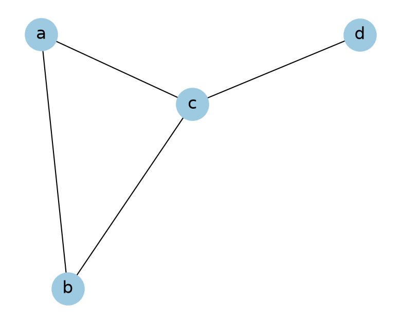
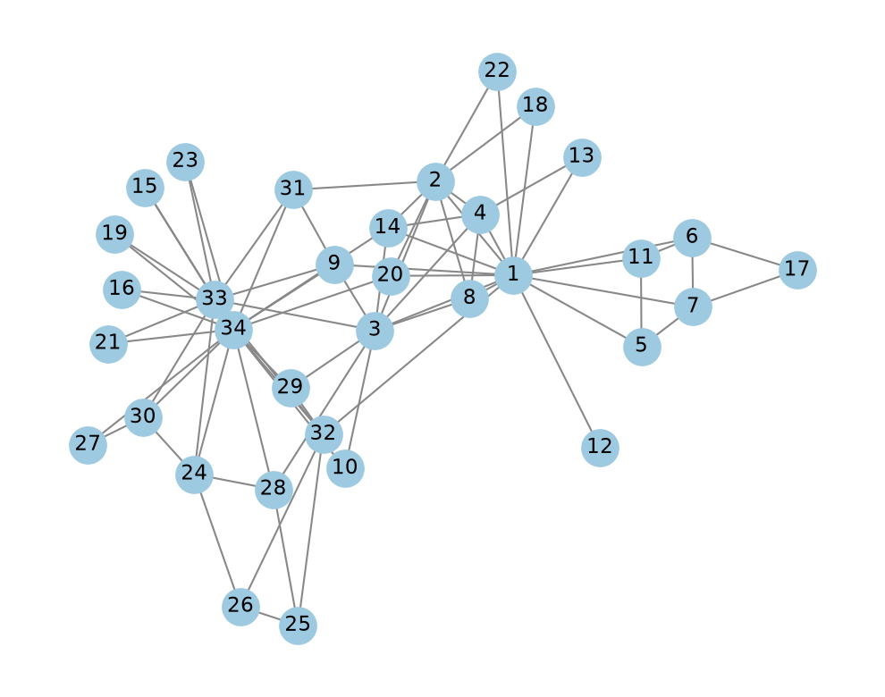

# Network basics

A network describes a set of items and the relationships between them.
Social media data has many networks: accounts that follow each other, accounts that reply to each other, and hashtags that appear in the same post.
Use a network when your question is about the relationships, not only about the single accounts or posts.

This page covers the terms, and the first steps with NetworkX: create a network, look at it, compute the degrees, and load a network from a file.

The [NetworkX Basics notebook](networkx-basics.ipynb) runs all the code on this page.
A comment after a line of code shows the result of that line.

## What a network is

A network has nodes, and edges that connect the nodes.
An edge is also called a link.

| Network | Node | Edge |
|---------|------|------|
| A social network | A person | A friendship |
| The web | A webpage | A link from one page to another |
| The power grid | A power plant | A cable |

The first known use of a network is the problem of the seven bridges of Königsberg.
Leonhard Euler drew the land areas of the city as nodes and the bridges as edges, and he proved that no walk crosses each bridge exactly once.
[Section 2.1 of the *Network Science* book](https://networksciencebook.com/chapter/2#bridges) tells the story.

## Directed, undirected, and weighted networks

- In an **undirected** network, an edge has no direction. Friendship on Facebook is an example: if A is a friend of B, then B is a friend of A.
- In a **directed** network, an edge goes from one node to another. Following on Bluesky is an example: an account can follow another account that does not follow it back.
- In an **unweighted** network, all edges are equal.
- In a **weighted** network, each edge has a number, which is called its weight. A network of airports is an example: the weight is the number of flights between two airports.

## Create a network with NetworkX

[NetworkX](https://networkx.org/) is a Python package for networks.
It is easy to use.
It can be slow on a network with millions of nodes and edges.

Install it with `pip install networkx` or `uv add networkx`.
Colab already has it.

The code on this page uses these imports and figure settings.

```python
import matplotlib.pyplot as plt
import networkx as nx
import numpy as np
import pandas as pd

# Figure settings: a larger font, and tick marks drawn behind the data.
plt.rcParams.update({"font.size": 14, "axes.axisbelow": True})
```

NetworkX calls a network a graph.
`nx.Graph()` creates an empty undirected network.
A node can have any name that Python can use as a dictionary key, for example a string or a number.

```python
# A "plain" graph is undirected
G = nx.Graph()

# Give each node a name, which is a letter here
G.add_node("a")

# Add several nodes from a list
G.add_nodes_from(["b", "c", "d"])

# Add an edge from "a" to "b"
# The graph is undirected, so the order does not matter
G.add_edge("a", "b")

# Add several edges from a list of 2-tuples
G.add_edges_from([("a", "c"), ("b", "c"), ("c", "d")])
```

`nx.draw` draws the network.
Without the argument `pos`, it chooses the positions of the nodes at random, so each run gives a different picture.
`nx.spring_layout(G, seed=415)` computes the positions with a fixed seed, so each run gives the same picture.

```python
plt.figure(figsize=(5, 4))
nx.draw(
    G,
    pos=nx.spring_layout(G, seed=415),
    with_labels=True,
    node_color="#9ecae1",
    node_size=900,
    font_size=16,
)
plt.show()
```

{ width="400" }

The nodes `a`, `b`, and `c` form a triangle.
The node `d` is connected only to `c`.

For a directed network, use `nx.DiGraph()` in place of `nx.Graph()`.
In a directed network, `add_edge("a", "b")` adds an edge from `a` to `b`, so the order matters.

## Look at a network

```python
G.nodes()    # NodeView(('a', 'b', 'c', 'd'))
G.edges()    # EdgeView([('a', 'b'), ('a', 'c'), ('b', 'c'), ('c', 'd')])

print(G.number_of_nodes())    # 4
print(G.number_of_edges())    # 4

# The neighbors of the node "b"
list(G.neighbors("b"))    # ['a', 'c']
```

- `G.nodes()` lists the nodes, and `G.edges()` lists the edges. Each edge is a pair of nodes.
- The network has 4 nodes and 4 edges.
- The neighbors of a node are the nodes that share an edge with it. `G.neighbors` returns an iterator, so the code needs `list` to show the neighbors.

## Degree

The degree of a node is the number of edges that it has.
In an undirected network, this is also the number of its neighbors.

```python
# Count the neighbors of a node
len(list(G.neighbors("a")))    # 2
# Or, use G.degree
G.degree("a")    # 2
```

A node of a directed network has two degrees.

- The **in-degree** is the number of edges that point to the node.
- The **out-degree** is the number of edges that point from the node.

A network made with `nx.DiGraph()` has `G.in_degree` and `G.out_degree` for them.
Take a follower network with an edge from each follower to the account that it follows.
There the in-degree of an account is its number of followers, and the out-degree is the number of accounts that it follows.

## Degree distribution

The degree distribution of a network is the share of the nodes that have each degree.
`G.degree()` without an argument gives the degree of every node, as pairs of a node and its degree.
The next code puts the degrees in a pandas Series.

```python
degree_sequence = pd.Series([d for _, d in G.degree()])
degree_sequence.tolist()    # [2, 2, 3, 1]
```

The degrees are in the order of the nodes `a`, `b`, `c`, and `d`.
One node has degree 1, two nodes have degree 2, and one node has degree 3.
A histogram of the degrees shows the distribution.

```python
plt.hist(degree_sequence)
plt.xlabel("Degree")
plt.ylabel("Frequency")
plt.show()
```

The degree distribution of a real network is highly skewed: a few nodes have very high degrees, and most nodes have low degrees.
A histogram of such degrees needs log scales.
See [Degree distributions of real networks](paths-and-degrees.md#degree-distributions-of-real-networks).

## Edge list and adjacency matrix

There are two common ways to write down a network.

An **edge list** has one row for each edge.
`nx.to_pandas_edgelist` returns the edge list of a network as a table.

```python
nx.to_pandas_edgelist(G)
```

| source | target |
|--------|--------|
| a | b |
| a | c |
| b | c |
| c | d |

The edge list of a weighted network has a third column with the weight of each edge.
You can store an edge list as a CSV file.
The file does not say whether the network is directed, so you must state it.
Many network data files are edge lists.

An **adjacency matrix** has one row and one column for each node.
The entry in row i and column j is 1 if an edge connects node i and node j, and 0 otherwise.
`nx.to_numpy_array` returns the adjacency matrix.
The rows and the columns are in the order of `G.nodes()`.

```python
nx.to_numpy_array(G)
```

```text
array([[0., 1., 1., 0.],
       [1., 0., 1., 0.],
       [1., 1., 0., 1.],
       [0., 0., 1., 0.]])
```

The first row is the node `a`, which is connected to `b` and `c`.
The matrix of an undirected network is symmetric.
The sum of a row is the degree of the node.
A network with n nodes has a matrix with n × n entries, so the matrix of a large network needs much more space than its edge list.

## Load a network from a file

Most networks come from a file.
The example is Zachary's karate club network: the social ties among the 34 members of a university karate club ([Zachary, 1977](https://doi.org/10.1086/jar.33.4.3629752)).
The file is an edge list.
Each line has the numbers of two members who are connected, and the first line is `2 1`.

`nx.read_edgelist` reads such a file and returns an undirected network.

```python
import pathlib
import urllib.request

import networkx as nx

# The file is not in the site repository. This cell downloads it once from the
# public course repository, at a fixed commit.
url = (
    "https://raw.githubusercontent.com/YangKCLab/social-media-ds-course/"
    "cb145f40a693e111025273947d0e430d7d325a33/demos/network/karate.edgelist"
)
path = pathlib.Path("data") / "karate.edgelist"
path.parent.mkdir(exist_ok=True)
if not path.exists():
    urllib.request.urlretrieve(url, path)

karate_g = nx.read_edgelist(path)
karate_g.number_of_nodes()    # 34
karate_g.number_of_edges()    # 78
```

The code downloads the file (407 bytes) into a folder `data/`, unless the file is already there.
The network has 34 nodes and 78 edges.

NetworkX reads the node names of an edge list file as strings.

```python
list(karate_g.nodes())[:5]    # ['2', '1', '3', '4', '5']
```

The node is `"1"`, not `1`.
The first line of the file is `2 1`, so `"2"` is the first node.

When the edge list is in a pandas table, use `nx.from_pandas_edgelist`.
[Centrality](centrality.md#example-a-character-network) has an example.

Draw the network with a fixed layout.

```python
pos = nx.spring_layout(karate_g, seed=415)

plt.figure(figsize=(6.4, 5))
nx.draw(
    karate_g,
    pos=pos,
    with_labels=True,
    node_color="#9ecae1",
    node_size=380,
    font_size=11,
    edge_color="#888888",
)
plt.show()
```

{ width="560" }

Each node is one member of the club, and each edge is a social tie between two members.
The nodes `34`, `1`, and `33` have the most edges: 17, 16, and 12.

## Bipartite networks

A bipartite network has two sets of nodes.
Every edge connects a node of one set and a node of the other set, and no edge connects two nodes of the same set.
Two examples are a network of patients and doctors, and a network of accounts and the hashtags that they use.

A projection turns a bipartite network into a network with one kind of node.
It connects two nodes of one set if they share a neighbor in the other set: two accounts are connected if they used the same hashtag.

[Networks from posts](networks-from-posts.md#user-hashtag-network) has the code for a bipartite network and its projection.
[Section 2.7 of the *Network Science* book](https://networksciencebook.com/chapter/2#bipartite-networks) has a drawing of a bipartite network with its two projections.

## Links

- [NetworkX Basics notebook](networkx-basics.ipynb): all the code on this page
- The [NetworkX tutorial](https://networkx.org/documentation/stable/tutorial.html): more ways to create a network and to read its nodes and edges
- Barabási, [*Network Science*, chapter 2](https://networksciencebook.com/chapter/2): degree, degree distribution, and adjacency matrix, with drawings of each. The book is free to read online
- Zachary (1977), [An Information Flow Model for Conflict and Fission in Small Groups](https://doi.org/10.1086/jar.33.4.3629752): the paper of the karate club network

Next: [Paths and degree distributions](paths-and-degrees.md) covers distances, small worlds, hubs, and the friendship paradox.
