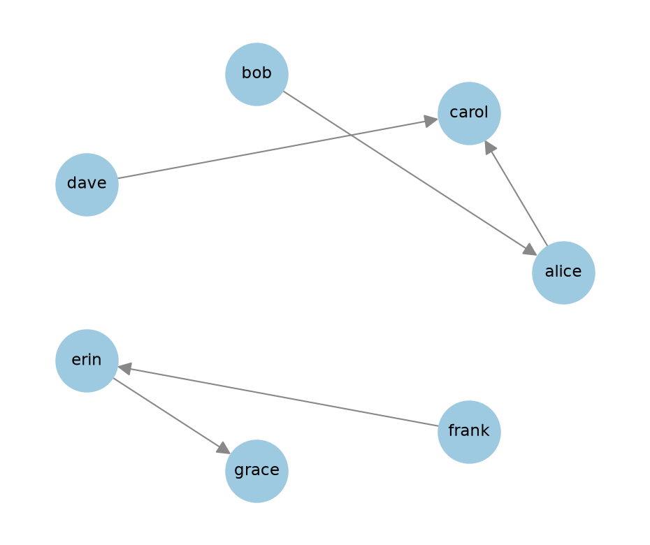

# Networks from posts

Social media data usually comes as a table of posts, not as a network.
You have to build the network, and the same posts can give several networks.
Which one you build depends on your question: who replies to whom, who shares interests with whom, or which hashtags appear together.

This page builds four networks from ten hand-written posts: a user-hashtag network, its projection onto the accounts, a hashtag co-occurrence network, and a reply network.
It then finds the connected components of a network and saves a network to a file.
The same code works for other posts that have the same four columns.

The [Posts to Networks notebook](posts-to-networks.ipynb) runs all the code on this page.
A comment after a line of code shows the result of that line, rounded.
The code uses these imports.

```python
import collections
import itertools
import pathlib
import re

import matplotlib.pyplot as plt
import networkx as nx
import pandas as pd
```

## Common networks on social media

| Network | Nodes | An edge means | Kind of network |
|---------|-------|---------------|-----------------|
| User-user | Accounts | One account follows another account, or replies to it, reposts it, or mentions it | Directed |
| User-item | Accounts, and items such as hashtags or links | An account used a hashtag or shared a link | Bipartite |
| Item-item | Items, such as hashtags | Two hashtags appear in the same post | Undirected, with weights |

A projection turns a user-item network into a user-user network or an item-item network.
For example, two accounts are connected if they used the same hashtag.

## The posts

The ten posts are hand-written.
No post, account, or hashtag comes from real data.

```python
posts = pd.DataFrame(
    [
        (1, "alice", None, "Drew my first network today #python #networks"),
        (2, "bob", 1, "@alice which layout did you use? #networks"),
        (3, "carol", None, "A chart of follower counts on a log axis #dataviz #python"),
        (4, "dave", 3, "@carol the log axis helps a lot #dataviz"),
        (5, "alice", 3, "@carol can you share the code? #python #dataviz"),
        (6, "erin", None, "Foggy trail this morning #hiking #coffee"),
        (7, "frank", 6, "@erin which trail is this? #hiking"),
        (8, "grace", None, "Saw a heron at the lake #birds #hiking"),
        (9, "erin", 8, "@grace great photo #birds"),
        (10, "heidi", None, "Testing my new account"),
    ],
    columns=["post_id", "author", "reply_to", "text"],
).astype({"reply_to": "Int64"})

posts
```

```python
print(len(posts), posts.author.nunique())    # 10 8
```

The table has 10 posts by 8 accounts.
Each post has four fields.

- `post_id`: the ID of the post.
- `author`: the account that wrote the post.
- `reply_to`: the `post_id` of the post that this post replies to. It is empty for a post that is not a reply.
- `text`: the text of the post.

In the code, `None` marks an empty value.
`astype({"reply_to": "Int64"})` keeps the IDs in this column as integers, although some values are empty.

## Extract the hashtags

A hashtag is a `#` sign followed by letters, digits, or underscores.
The regular expression `#\w+` finds every hashtag in a text.
The function changes the text to lowercase first, so `#Python` and `#python` count as the same hashtag.

```python
def extract_hashtags(text):
    return re.findall(r"#\w+", text.lower())


posts["hashtags"] = posts.text.apply(extract_hashtags)
posts[["author", "hashtags"]]
```

The new column holds a list of hashtags for each post.
The first post has the list `['#python', '#networks']`, and the post of `heidi` has an empty list.

`explode` turns each list into rows, so the table gets one row for each pair of a post and a hashtag.
A post with an empty list gets one row with an empty value, and `dropna` removes it.

```python
uses = posts.explode("hashtags").dropna(subset=["hashtags"])
uses = uses.rename(columns={"hashtags": "hashtag"})[["post_id", "author", "hashtag"]]

len(uses)    # 14
```

The ten posts use a hashtag 14 times.
Now count how many posts of each account use each hashtag.

```python
user_hashtag = uses.groupby(["author", "hashtag"]).size().reset_index(name="weight")

len(user_hashtag)    # 13
```

The table `user_hashtag` has 13 rows, one for each pair of an account and a hashtag.
`alice` used `#python` in two posts, so this pair has the weight 2.
Every other pair has the weight 1.

## User-hashtag network

A bipartite network has two sets of nodes, and every edge connects a node of one set and a node of the other set.
Here one set holds the accounts and the other set holds the hashtags.
An edge connects an account and a hashtag that the account used.
The weight of an edge is the number of posts.

Use this network to see which accounts use which hashtags, and as the first step to a projection.

By convention, NetworkX marks the two sets with a node attribute named `bipartite`, with the values 0 and 1.
The hashtag nodes keep the `#` sign, so a hashtag and an account can never have the same node name.

```python
accounts = uses.author.unique().tolist()
hashtags = uses.hashtag.unique().tolist()

user_hashtag_g = nx.Graph()
user_hashtag_g.add_nodes_from(accounts, bipartite=0)
user_hashtag_g.add_nodes_from(hashtags, bipartite=1)
user_hashtag_g.add_weighted_edges_from(user_hashtag.itertuples(index=False, name=None))

print(user_hashtag_g.number_of_nodes(), user_hashtag_g.number_of_edges())    # 13 13
```

The network has 13 nodes (7 accounts and 6 hashtags) and 13 edges.
`add_weighted_edges_from` takes triples of two nodes and a weight.
`itertuples(index=False, name=None)` turns each row of the table into such a triple.

`heidi` used no hashtag, so she is not in this network.

```python
print(nx.is_bipartite(user_hashtag_g))    # True
print(user_hashtag_g["alice"]["#python"]["weight"])    # 2
```

The next code draws the network with the accounts in the left column and the hashtags in the right column.
It sets the positions by hand: each node gets an x value for its column and a y value for its row.
`nx.bipartite_layout` also makes two columns, but the order of the nodes in a column can change from run to run.
The width of an edge shows its weight.

```python
pos = {}
for i, account in enumerate(accounts):
    pos[account] = (0, -i)
for i, hashtag in enumerate(hashtags):
    pos[hashtag] = (1, -i)

plt.figure(figsize=(6, 5.5))
nx.draw(
    user_hashtag_g,
    pos=pos,
    with_labels=True,
    node_color=["#9ecae1" if v in accounts else "#fdd0a2" for v in user_hashtag_g],
    node_size=2000,
    font_size=10,
    width=[1.5 * w for _, _, w in user_hashtag_g.edges(data="weight")],
    edge_color="#888888",
)
plt.margins(0.15)
plt.show()
```

{ width="480" }

The picture shows two groups.
The accounts `alice`, `bob`, `carol`, and `dave` use `#python`, `#networks`, and `#dataviz`.
The accounts `erin`, `frank`, and `grace` use `#hiking`, `#coffee`, and `#birds`.
No edge connects the two groups.

## Projection onto the accounts

In the projection onto the accounts, two accounts are connected if they used the same hashtag.
Use it to find accounts with shared interests.

`nx.bipartite.weighted_projected_graph` builds the projection.
The weight of an edge is the number of hashtags that the two accounts share.
The function does not use the weights of the user-hashtag network.

```python
account_g = nx.bipartite.weighted_projected_graph(user_hashtag_g, accounts)

print(account_g.number_of_nodes(), account_g.number_of_edges())    # 7 7
print(account_g["alice"]["carol"]["weight"])    # 2
```

The projection has 7 nodes and 7 edges.
`alice` and `carol` share 2 hashtags, `#python` and `#dataviz`.

The next code draws the projection.
`nx.circular_layout` puts the nodes on a circle.
It has no random step, so it needs no seed.
`nx.draw_networkx_edge_labels` writes the weight on each edge.

```python
pos = nx.circular_layout(account_g)

plt.figure(figsize=(6, 5))
nx.draw(
    account_g,
    pos=pos,
    with_labels=True,
    node_color="#9ecae1",
    node_size=1800,
    font_size=11,
    edge_color="#888888",
)
nx.draw_networkx_edge_labels(
    account_g,
    pos,
    edge_labels=nx.get_edge_attributes(account_g, "weight"),
    font_size=12,
    rotate=False,
)
plt.margins(0.1)
plt.show()
```

{ width="480" }

The first group has four accounts and four edges.
The second group has three accounts and three edges.

## Hashtag co-occurrence network

In a co-occurrence network, two hashtags are connected if they appear in the same post.
The weight of an edge is the number of such posts.
Use it to find hashtags that appear together, for example to find the topics in a set of posts.

`itertools.combinations(tags, 2)` returns every pair of the hashtags of one post.
`sorted(set(tags))` removes a hashtag that a post uses twice.
It also puts the hashtags in a fixed order, so the pairs `(a, b)` and `(b, a)` are counted together.
A `Counter` counts each pair over all posts.

```python
pair_counts = collections.Counter()
for tags in posts.hashtags:
    for pair in itertools.combinations(sorted(set(tags)), 2):
        pair_counts[pair] += 1

cooccurrence_g = nx.Graph()
cooccurrence_g.add_nodes_from(hashtags)
cooccurrence_g.add_weighted_edges_from((a, b, n) for (a, b), n in pair_counts.items())

print(cooccurrence_g.number_of_nodes(), cooccurrence_g.number_of_edges())    # 6 4
print(cooccurrence_g["#python"]["#dataviz"]["weight"])    # 2
```

The network has 6 nodes and 4 edges.
`#python` and `#dataviz` appear together in 2 posts.
`add_nodes_from(hashtags)` adds every hashtag as a node, also a hashtag that never appears together with another hashtag.

This network is not the same as the projection of the user-hashtag network onto the hashtags.
The projection connects two hashtags if one account used both, also in two different posts.
The next code builds the projection and lists the edges that only the projection has.

```python
hashtag_g = nx.bipartite.weighted_projected_graph(user_hashtag_g, hashtags)

print(hashtag_g.number_of_edges())    # 6
print(sorted(nx.difference(hashtag_g, cooccurrence_g).edges()))    # [('#coffee', '#birds'), ('#networks', '#dataviz')]
```

The projection has 6 edges, two more than the co-occurrence network.
`erin` used `#coffee` and `#birds` in two different posts, and `alice` used `#networks` and `#dataviz` in two different posts.

- Use the co-occurrence network to ask which hashtags appear in the same post.
- Use the projection to ask which hashtags the same accounts use.

## Reply network

A reply network is a directed network.
An edge goes from the account that replies to the account that wrote the original post.
Use it to see who replies to whom.

The reply network comes from the column `reply_to`.
The code does not read the mentions in the text, such as `@alice`.

The column `reply_to` holds the ID of a post, so the first step finds the author of that post.
`author_of` maps each `post_id` to its author.

```python
author_of = posts.set_index("post_id").author

replies = posts.dropna(subset=["reply_to"]).copy()
replies["original_author"] = replies.reply_to.map(author_of)
replies[["author", "original_author"]]
```

Five of the ten posts are replies.

| author | original_author |
|--------|-----------------|
| bob | alice |
| dave | carol |
| alice | carol |
| frank | erin |
| erin | grace |

In collected data, the original post can be missing from the table.
`map` then gives an empty value for the original author, and you have to drop these rows before the next step.

Now count the replies of each pair of accounts, and add the pairs to a `DiGraph` as edges.

```python
reply_edges = (
    replies.groupby(["author", "original_author"]).size().reset_index(name="weight")
)

reply_g = nx.DiGraph()
reply_g.add_weighted_edges_from(reply_edges.itertuples(index=False, name=None))

print(reply_g.number_of_nodes(), reply_g.number_of_edges())    # 7 5
```

The reply network has 7 nodes and 5 edges.
The weight of an edge is the number of replies from one account to the other.
Here every weight is 1.

A repost network is built in the same way, from the field that holds the ID of the reposted post.

```python
print(dict(reply_g.in_degree()))
print(dict(reply_g.out_degree()))
```

```text
{'alice': 1, 'carol': 2, 'bob': 0, 'dave': 0, 'erin': 1, 'grace': 1, 'frank': 0}
{'alice': 1, 'carol': 0, 'bob': 1, 'dave': 1, 'erin': 1, 'grace': 0, 'frank': 1}
```

- The in-degree of an account is the number of accounts that replied to it. `carol` has the highest in-degree, 2.
- The out-degree of an account is the number of accounts that it replied to.

`nx.draw` draws a directed network with arrows.

```python
plt.figure(figsize=(6, 5))
nx.draw(
    reply_g,
    pos=nx.circular_layout(reply_g),
    with_labels=True,
    node_color="#9ecae1",
    node_size=1800,
    font_size=11,
    edge_color="#888888",
    arrowsize=20,
)
plt.margins(0.1)
plt.show()
```

{ width="480" }

Each arrow points from the account that replies to the author of the original post.

`heidi` used no hashtag, wrote no reply, and got no reply.
She is in none of the networks, because each network was built from a list of edges.
When the analysis needs every account, add the missing accounts as nodes with `add_nodes_from`.
The notebook has the code.

## Connected components

A network is connected when there is a path between every pair of nodes.
A network built from posts is usually not connected.
A connected component is a group of nodes with a path between every pair of them, and with no edge to a node outside the group.

The example is the projection onto the accounts.

```python
nx.is_connected(account_g)    # False
```

Some functions need a connected network.
`nx.average_shortest_path_length` raises an error, because two accounts in different components have no path between them.

```python
try:
    nx.average_shortest_path_length(account_g)
except nx.NetworkXError as error:
    print(error)    # Graph is not connected.
```

`nx.connected_components` returns each component as a set of nodes.

```python
print(nx.number_connected_components(account_g))    # 2

components = sorted(nx.connected_components(account_g), key=len, reverse=True)
print([sorted(c) for c in components])    # [['alice', 'bob', 'carol', 'dave'], ['erin', 'frank', 'grace']]
```

The network has 2 components, one with four accounts and one with three.

A common step is to keep only the largest component.
`subgraph` returns a view of the network with only the given nodes, and `.copy()` makes it a new network.

```python
largest = max(nx.connected_components(account_g), key=len)
largest_g = account_g.subgraph(largest).copy()

print(largest_g.number_of_nodes(), largest_g.number_of_edges())    # 4 4
print(nx.average_shortest_path_length(largest_g))    # 1.33
```

The largest component has 4 nodes and 4 edges, and its average shortest path length is 1.33.
When you report a result for the largest component, also report how many nodes of the network it holds.

`nx.connected_components` does not accept a directed network.
For a directed network, `nx.weakly_connected_components` finds the components without the direction of the edges.

```python
[sorted(c) for c in nx.weakly_connected_components(reply_g)]    # [['alice', 'bob', 'carol', 'dave'], ['erin', 'frank', 'grace']]
```

The reply network has the same two groups.

## Save the network

Save a network to a file to use it in another tool.

- `nx.write_gexf` writes a GEXF file. The file holds the nodes, the edges, the node attributes, and the edge weights. [Gephi](https://gephi.org/) is a desktop application that draws and explores networks, and it opens GEXF files. See the [Gephi quick start](https://gephi.org/quickstart/) for the first steps.
- A CSV edge list is a simpler format that most tools read. `nx.to_pandas_edgelist` returns the edges as a table, and `to_csv` writes the table.

The next code writes both files for the user-hashtag network, into a folder `data/`.

```python
data_dir = pathlib.Path("data")
data_dir.mkdir(exist_ok=True)

nx.write_gexf(user_hashtag_g, data_dir / "user-hashtag-network.gexf")
nx.to_pandas_edgelist(user_hashtag_g).to_csv(
    data_dir / "user-hashtag-network.csv", index=False
)
```

The CSV file has one line for each of the 13 edges, after the header line.
Its first four lines:

```text
source,target,weight
alice,#dataviz,1
alice,#networks,1
alice,#python,2
```

The GEXF file also holds the attribute `bipartite` of each node, and `nx.read_gexf` reads the file back into NetworkX.

A GEXF file says whether the network is directed.
A CSV edge list does not, so state it when you share the file.

## What to measure next

- [Paths and degree distributions](paths-and-degrees.md) covers the distances and the degree distribution of a network. Keep the largest connected component first when you compute distances.
- [Centrality](centrality.md) finds the most important nodes, such as the accounts that get the most replies in a reply network.
- [Communities](communities.md) finds groups, such as accounts that share hashtags in a projection or hashtags that appear together in a co-occurrence network.

## Further topics

This section does not cover the three topics below.
Each one has a link to start from.

- **Clustering coefficient.** The clustering coefficient of a node is the share of the pairs of its neighbors that are connected to each other. A high average value means that the friends of a node tend to be friends too. See [`clustering` and `average_clustering` in NetworkX](https://networkx.org/documentation/stable/reference/algorithms/clustering.html).
- **Other community detection methods.** The Louvain method is one of many methods. Another method, such as label propagation or the Girvan-Newman method, can divide the same network in a different way. See [the community functions of NetworkX](https://networkx.org/documentation/stable/reference/algorithms/community.html).
- **Network embedding.** A network embedding method turns each node into a vector, so that nodes that are close in the network get vectors that are close. A word embedding does the same for words. See [Perozzi, Al-Rfou, and Skiena (2014)](https://arxiv.org/abs/1403.6652). Figure 1 of the paper shows the karate club network as points in two dimensions.

## Links

- [Posts to Networks notebook](posts-to-networks.ipynb): all the code on this page
- The NetworkX documentation of the [bipartite functions](https://networkx.org/documentation/stable/reference/algorithms/bipartite.html), of the [component functions](https://networkx.org/documentation/stable/reference/algorithms/component.html), and of the [GEXF format](https://networkx.org/documentation/stable/reference/readwrite/gexf.html)
- [Gephi](https://gephi.org/) and its [quick start](https://gephi.org/quickstart/)
