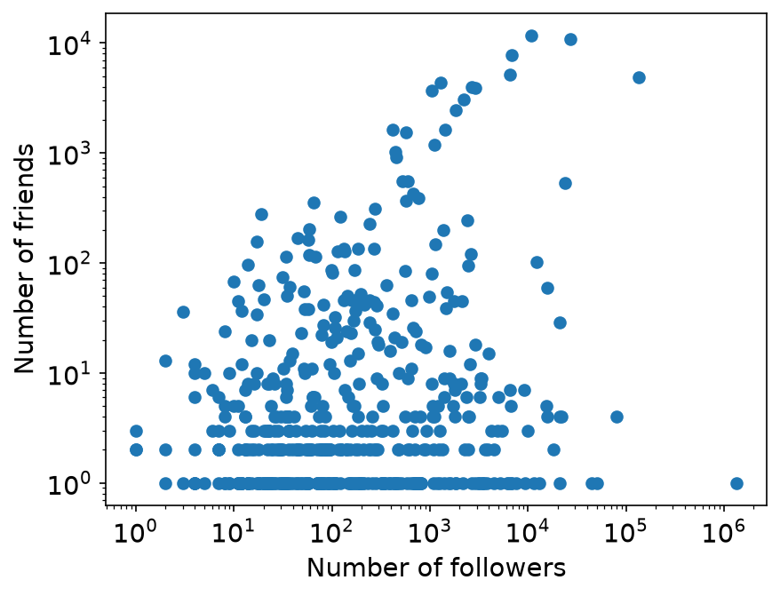

# Correlation

Two values are correlated when a change in one value goes with a change in the other value.
This page shows how to plot the relationship between two values, how to measure it with a correlation coefficient, and what a correlation does not tell you.

The [Correlation Analysis notebook](correlation-analysis.ipynb) runs all the code on this page.
A comment after a line of code shows the result of that line, rounded.
The code uses these imports and figure settings.

```python
import matplotlib.pyplot as plt
import numpy as np
import scipy.stats

# Figure settings: a larger font, and tick marks drawn behind the data.
plt.rcParams.update({"font.size": 14, "axes.axisbelow": True})
```

## Correlation is not causation

A correlation does not show that one value causes the other.

- The correlation can be a coincidence.
- A third factor, called a confounding factor, can drive both values.

[Spurious Correlations](https://www.tylervigen.com/spurious-correlations) by Tyler Vigen collects many pairs of unrelated values that are correlated by coincidence.

## How you select the data matters

The way you select the data can create a correlation.
This effect is called Berkson's paradox.

- Among all applicants to a school, a higher GPA goes with a higher SAT score.
- The school rejects the weakest applicants, and the strongest applicants choose a better school.
- Among the students who enroll at this school, a higher GPA goes with a lower SAT score.

The selection created the second correlation.
It is the opposite of the correlation among all applicants.
The page [Berkson's paradox](https://brilliant.org/wiki/berksons-paradox/) of the Brilliant wiki shows this example in a figure.

Social media data is always a selected sample.
It is selected by platform, by keyword, and by who chooses to post.

## Look at the data first

The example asks one question: is there a correlation between the number of friends and the number of followers of an account?
Friends are the accounts that an account follows.

The data is Botwiki-2019: 698 Twitter accounts that identified themselves as bots.
The dataset comes from the [Bot Repository](https://botometer.osome.iu.edu/bot-repository/datasets.html) ([Yang et al., 2020](https://doi.org/10.1609/aaai.v34i01.5460)), and it has the license [CC BY-NC-ND 4.0](https://creativecommons.org/licenses/by-nc-nd/4.0/).

```python
import gzip
import json
import pathlib
import urllib.request

import pandas as pd

# The file is not in the site repository. This cell downloads it once from the
# public course repository, at a fixed commit.
url = (
    "https://raw.githubusercontent.com/YangKCLab/social-media-ds-course/"
    "b4a210426ebfec34f2e983983efde03eeb3dba8d/demos/stats/botwiki-2019_tweets.json.gz"
)
path = pathlib.Path("data") / "botwiki-2019_tweets.json.gz"
path.parent.mkdir(exist_ok=True)
if not path.exists():
    urllib.request.urlretrieve(url, path)

with gzip.open(path) as f:
    botwiki = json.load(f)
botwiki_df = pd.DataFrame.from_records([item["user"] for item in botwiki])
botwiki_df = botwiki_df[["followers_count", "friends_count"]]
len(botwiki_df)    # 698
```

The code downloads the file (154 KB) into a folder `data/`, unless the file is already there.
It keeps two fields of each account: `followers_count` and `friends_count`.

Plot the data before you compute a number.
In a scatter plot, each point is one account.
Both values are highly skewed, so both axes need the log scale.
With linear axes, almost all points are in the lower left corner.

```python
plt.scatter(botwiki_df.followers_count, botwiki_df.friends_count)
plt.xscale("log")
plt.yscale("log")
plt.xlabel("Number of followers")
plt.ylabel("Number of friends")
plt.show()
```

{ width="480" }

A log axis cannot show 0, so an account with 0 friends is not in the plot.

```python
(botwiki_df.friends_count == 0).sum()    # 207
```

207 of the 698 accounts have 0 friends.

## Test the correlation

A correlation coefficient is a value between −1 and 1.

- A positive value means that the two values rise together.
- A negative value means that one value falls when the other rises.
- A value near 0 means no correlation.

The test also gives a p-value.
Its null hypothesis is that there is no correlation.

| Coefficient | What it measures | Function |
|-------------|------------------|----------|
| Pearson | A linear relationship. Extreme values distort it | `scipy.stats.pearsonr` |
| Spearman | A rank correlation. It uses the ranks of the values, so it works for skewed data | `scipy.stats.spearmanr` |

```python
x, y = botwiki_df.followers_count, botwiki_df.friends_count

scipy.stats.spearmanr(x, y)    # statistic=0.273, pvalue=2.2e-13
scipy.stats.pearsonr(x, y)    # statistic=0.033, pvalue=0.38
```

Both functions use all 698 accounts, including the accounts with 0 friends.

- The Spearman coefficient is 0.273 with a p-value of 2.2e-13. This is a weak positive correlation, and it is significant.
- The Pearson coefficient is 0.033 with a p-value of 0.38. Pearson finds no correlation, because a few accounts with very high values dominate the result.

For skewed data such as these counts, use the Spearman coefficient.

## 2D histogram

Many points overlap in a scatter plot, so you cannot see where most of them are.
A 2D histogram counts the points in each cell of a grid and shows the counts as colors.

The bins are in log scale on both axes.
`plt.hist2d` returns four values.
The fourth value, `h[3]`, is the image that `plt.colorbar` needs.

```python
h = plt.hist2d(
    botwiki_df.followers_count,
    botwiki_df.friends_count,
    bins=[np.logspace(0, 6, 20), np.logspace(0, 5, 20)],
)
plt.xscale("log")
plt.yscale("log")
plt.colorbar(h[3], label="Number of accounts")
plt.xlabel("Number of followers")
plt.ylabel("Number of friends")
plt.show()
```

{ width="480" }

The brightest cells are in the bottom rows, between 10 and 1,000 followers.
Most of the counted accounts have only a few friends.
The fullest cell holds 27 accounts.

The histogram counts 490 of the 698 accounts.
An account outside the bins is not counted, and the accounts with 0 friends are outside.

When the counts in the cells differ by orders of magnitude, a linear color scale shows only the fullest cells.
The argument `norm="log"` puts the color scale in log scale as well.

```python
h = plt.hist2d(
    botwiki_df.followers_count,
    botwiki_df.friends_count,
    bins=[np.logspace(0, 6, 20), np.logspace(0, 5, 20)],
    norm="log",
)
```

For a figure with a log color scale, see Figure 1 of [Yang et al. (2025)](https://doi.org/10.1038/s41597-025-05604-6).
Each cell of its 2D histograms counts web domains, and the counts go from 1 to 10,000.

## Links

- [Correlation Analysis notebook](correlation-analysis.ipynb): all the code on this page
- The SciPy documentation of [`spearmanr`](https://docs.scipy.org/doc/scipy/reference/generated/scipy.stats.spearmanr.html) and [`pearsonr`](https://docs.scipy.org/doc/scipy/reference/generated/scipy.stats.pearsonr.html)
- The matplotlib documentation of [`hist2d`](https://matplotlib.org/stable/api/_as_gen/matplotlib.pyplot.hist2d.html)
- [Spurious Correlations](https://www.tylervigen.com/spurious-correlations): correlations between unrelated values
- [Berkson's paradox](https://brilliant.org/wiki/berksons-paradox/) in the Brilliant wiki
- Yang et al. (2025), [DomainDemo: a dataset of domain-sharing activities among different demographic groups on Twitter](https://doi.org/10.1038/s41597-025-05604-6): Figure 1 has 2D histograms with a log color scale
