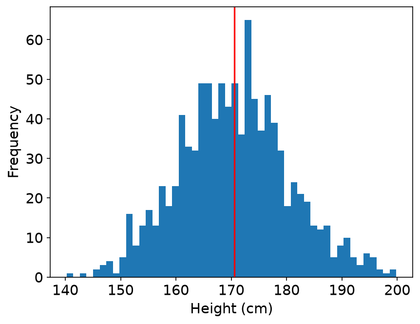
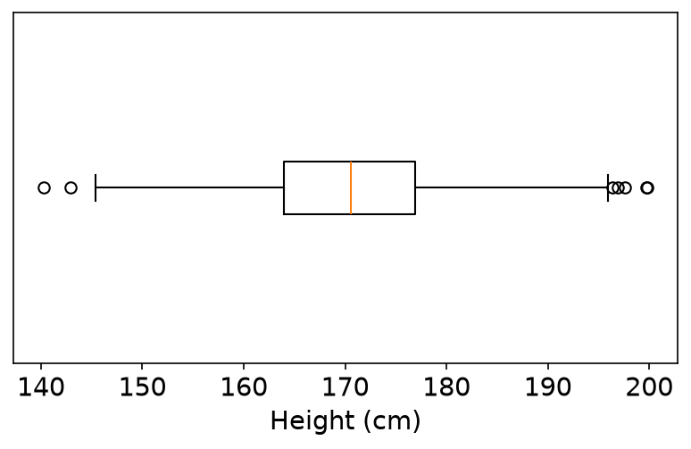
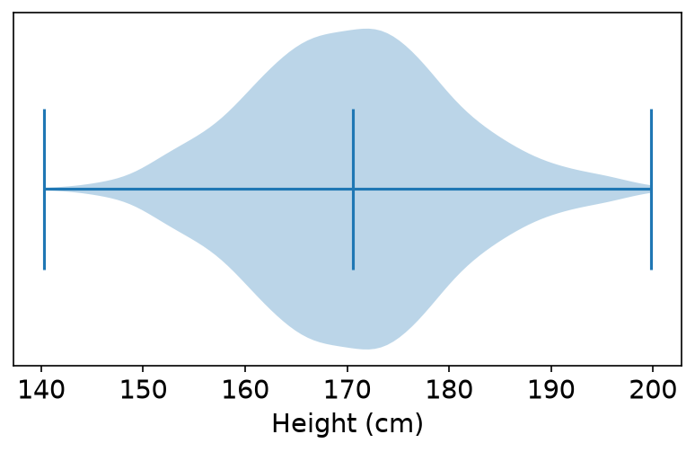
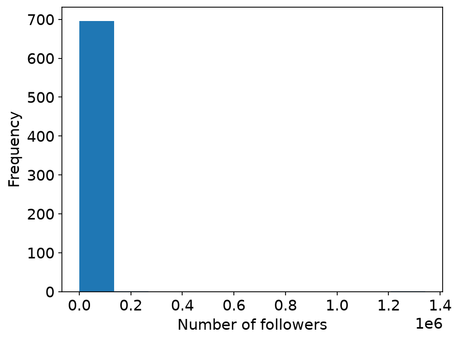
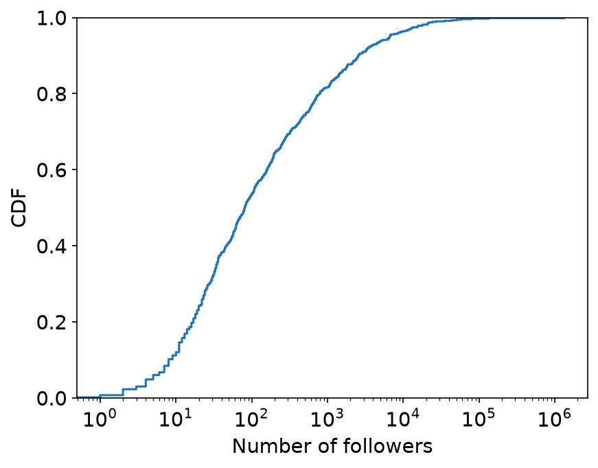
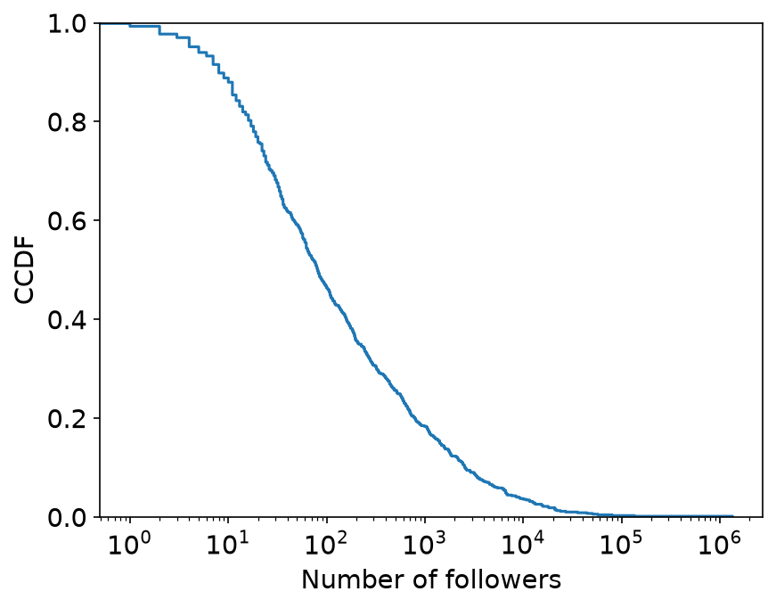

# Descriptive statistics and distributions

A set of numbers, such as the follower counts of many accounts, has a distribution.
Descriptive statistics summarize a distribution with one or two numbers.
A plot shows the whole distribution.

Social media data has many distributions: the number of reposts of each post, the number of followers of each account, or the toxicity score of each post.
This page covers the mean and the median, and five plots: the histogram, the box plot, the violin plot, the CDF, and the CCDF.

The [Distributions notebook](distributions.ipynb) runs all the code on this page.
A comment after a line of code shows the result of that line, rounded.
The code uses these imports and figure settings.

```python
import matplotlib.pyplot as plt
import numpy as np
import pandas as pd

# Figure settings: a larger font, and tick marks drawn behind the data.
plt.rcParams.update({"font.size": 14, "axes.axisbelow": True})
```

## Mean and median

- The mean is the average value.
- The median is the middle value when all values are sorted.

Extreme values change the mean a lot.
They do not change the median.

The example is the number of likes of seven posts.
Two of the posts have far more likes than the other five.

```python
num_of_likes = pd.Series([5, 8, 10, 12, 15, 100, 200])
print(f"Mean: {num_of_likes.mean()}")    # Mean: 50.0
print(f"Median: {num_of_likes.median()}")    # Median: 12.0
```

Five of the seven posts have fewer than 20 likes.
The median, 12, describes a typical post better than the mean, 50.

## Histogram

A histogram shows the whole distribution.
It is built in three steps:

1. Split the range of the values into bins of the same size.
2. Count the values in each bin.
3. Draw the counts as bars.

`plt.hist` does all three steps.
Always label the axes of a figure.

The example is 1,000 simulated heights.
They come from a normal distribution with a mean of 170 cm and a standard deviation of 10 cm.
`np.clip` limits them to the range from 140 cm to 210 cm.
The seed 415 makes every run give the same numbers.

```python
rng = np.random.default_rng(415)
heights = rng.normal(loc=170, scale=10, size=1000)
heights = np.clip(heights, 140, 210)
```

```python
print(f"Mean: {np.mean(heights):.2f}")    # Mean: 170.55
print(f"Median: {np.median(heights):.2f}")    # Median: 170.54
```

The next code draws the histogram with 50 bins.
`plt.axvline` marks the mean with a black line and the median with a red line.

```python
plt.hist(heights, bins=50)
plt.axvline(np.mean(heights), color="black")
plt.axvline(np.median(heights), color="red")
plt.xlabel("Height (cm)")
plt.ylabel("Frequency")
plt.show()
```

{ width="480" }

The histogram has one peak near 170 cm, and the two sides have about the same shape.
The mean is 170.55 cm and the median is 170.54 cm, so the two lines are at the same place.
The figure shows only the red line, because it is drawn on top of the black line.
For a symmetric distribution such as this one, either number describes the data well.

## Box plot and violin plot

A box plot shows a distribution in a small space.

- The box goes from the first quartile (Q1) to the third quartile (Q3). One quarter of the values are below Q1, and three quarters are below Q3.
- The line inside the box is the median.
- The interquartile range is IQR = Q3 − Q1.
- Each whisker reaches the farthest data point within 1.5 × IQR of the box.
- Points beyond the whiskers are drawn one by one.

```python
plt.figure(figsize=(6.4, 3.4))
plt.boxplot(heights, orientation="horizontal")
plt.yticks([])    # there is one box, so the y-axis needs no ticks
plt.xlabel("Height (cm)")
plt.show()
```

The argument `orientation` needs matplotlib 3.10 or later.

{ width="480" }

The box goes from about 164 cm to about 177 cm, and the median line is near 170.5 cm.
A few points are beyond the whiskers on both sides.

Box plots are useful for comparing groups.
Draw one box for each group, side by side on the same axis.
For an example, see panel c of Figure 3 in [Yang, Ferrara, and Menczer (2022)](https://doi.org/10.1007/s42001-022-00177-5), which compares the bot scores of three groups of tweets.

A violin plot also shows the shape of the distribution.
It is wide where there are many data points.
`showmedians=True` draws a line at the median.

```python
plt.figure(figsize=(6.4, 3.4))
plt.violinplot(heights, orientation="horizontal", showmedians=True)
plt.yticks([])
plt.xlabel("Height (cm)")
plt.show()
```

{ width="480" }

## Skewed data

Real social media data often looks very different from the heights.
The example is Botwiki-2019: 698 Twitter accounts that identified themselves as bots.
The dataset comes from the [Bot Repository](https://botometer.osome.iu.edu/bot-repository/datasets.html) ([Yang et al., 2020](https://doi.org/10.1609/aaai.v34i01.5460)), and it has the license [CC BY-NC-ND 4.0](https://creativecommons.org/licenses/by-nc-nd/4.0/).
The code uses two numbers for each account: the number of followers and the number of friends.
Friends are the accounts that an account follows.

```python
import gzip
import json
import pathlib
import urllib.request

import pandas as pd

# The file is not in the site repository. This cell downloads it once from the
# public course repository, at a fixed commit.
url = (
    "https://raw.githubusercontent.com/YangKCLab/social-media-ds-course/"
    "b4a210426ebfec34f2e983983efde03eeb3dba8d/demos/stats/botwiki-2019_tweets.json.gz"
)
path = pathlib.Path("data") / "botwiki-2019_tweets.json.gz"
path.parent.mkdir(exist_ok=True)
if not path.exists():
    urllib.request.urlretrieve(url, path)

with gzip.open(path) as f:
    botwiki = json.load(f)
botwiki_df = pd.DataFrame.from_records([item["user"] for item in botwiki])
botwiki_df = botwiki_df[["followers_count", "friends_count"]]
len(botwiki_df)    # 698
```

The code downloads the file (154 KB) into a folder `data/`, unless the file is already there.
The source file has 42 fields for each account, and the code keeps two of them: `followers_count` and `friends_count`.

Start with a histogram of the follower counts, with bins of the same size.

```python
plt.hist(botwiki_df.followers_count)
plt.xlabel("Number of followers")
plt.ylabel("Frequency")
plt.show()
```

{ width="480" }

Almost all accounts are in the first bin.
The distribution is highly skewed: a few accounts have very high values, and many accounts have very low values.
Bins of the same size do not work for such data.

Two changes fix the histogram.

1. **Create the bins in log scale.** `np.logspace(0, 6.2, num=20)` returns 20 bin edges from 10^0 = 1 to 10^6.2, which is about 1.6 million. Each bin is about 2.1 times as wide as the bin before it.
2. **Use the log scale on the x-axis.** With a linear axis, the narrow bins on the left cannot be seen.

```python
bins = np.logspace(0, 6.2, num=20)
print(bins.round(1).tolist())    # [1.0, 2.1, 4.5, 9.5, 20.2, ..., 1584893.2]
```

```python
plt.hist(botwiki_df.followers_count, bins=bins)
plt.xscale("log")
plt.xlabel("Number of followers")
plt.ylabel("Frequency")
plt.show()
```

The figure in the next section shows this histogram.
Be careful when you read such a figure, for two reasons.

- The bins differ in size by orders of magnitude.
- A log axis cannot show 0. One of the 698 accounts has 0 followers, and it is not in the plot.

## Mean and median of skewed data

```python
print(f"Mean: {botwiki_df.followers_count.mean():.2f}")    # Mean: 3511.87
print(f"Median: {botwiki_df.followers_count.median()}")    # Median: 81.0
```

The mean is 3,512 followers and the median is 81 followers.
The mean is about 43 times the median.
92% of the accounts have fewer followers than the mean.

The figure below is the histogram with log bins and a log axis.
Two `plt.axvline` calls, as in the histogram of heights, mark the mean with a black line and the median with a red line.

{ width="480" }

The median is in the middle of the accounts.
The mean is far to the right, because a few accounts with very many followers raise it.
For skewed data such as follower counts, report the median.

## Box plot of skewed data

A box plot of skewed data also needs the log scale.
With a linear axis, the box is squeezed into a line at the left edge of the plot.

```python
plt.figure(figsize=(6.4, 3.0))
plt.boxplot(botwiki_df.followers_count, orientation="horizontal")
plt.xscale("log")
plt.yticks([])
plt.xlabel("Number of followers")
plt.show()
```

With the log axis, you can see the box, the median line, and the many points beyond the right whisker.

## CDF and CCDF

- The cumulative distribution function (CDF) gives, for each value x, the share of data points with a value of at most x.
- The complementary cumulative distribution function (CCDF) gives the share of data points with a value larger than x. CCDF = 1 − CDF.

Neither plot needs bins, so you do not have to choose a bin size.
Both plots work well for highly skewed data.
Use the log scale on the x-axis here too.

`plt.ecdf` draws the CDF from the data.
It needs matplotlib 3.8 or later.

```python
plt.ecdf(botwiki_df.followers_count)
plt.xscale("log")
plt.xlabel("Number of followers")
plt.ylabel("CDF")
plt.show()
```

{ width="480" }

To read the CDF, pick a value on the x-axis and read the share on the y-axis.
At x = 1,000 the curve has a height of 0.82: 82% of the accounts have at most 1,000 followers.
The next line computes this share.

```python
(botwiki_df.followers_count <= 1000).mean()    # 0.817
```

For the CCDF, add `complementary=True`.

```python
plt.ecdf(botwiki_df.followers_count, complementary=True)
plt.xscale("log")
plt.xlabel("Number of followers")
plt.ylabel("CCDF")
plt.show()
```

{ width="480" }

At x = 1,000 the CCDF is 1 − 0.817 = 0.183: 18% of the accounts have more than 1,000 followers.

## Which summary to use

| Data | Number to report | Plot |
|------|------------------|------|
| A symmetric shape, such as the heights | The mean or the median | A histogram |
| A skewed shape, such as follower counts | The median | A histogram with log bins and a log axis, or a CDF or CCDF |
| Two or more groups to compare | The median of each group | Box plots side by side |

## Links

- [Distributions notebook](distributions.ipynb): all the code on this page
- The matplotlib documentation of [`hist`](https://matplotlib.org/stable/api/_as_gen/matplotlib.pyplot.hist.html), [`boxplot`](https://matplotlib.org/stable/api/_as_gen/matplotlib.pyplot.boxplot.html), [`violinplot`](https://matplotlib.org/stable/api/_as_gen/matplotlib.pyplot.violinplot.html), and [`ecdf`](https://matplotlib.org/stable/api/_as_gen/matplotlib.pyplot.ecdf.html)
- Yang, Varol, Hui, and Menczer (2020), [Scalable and generalizable social bot detection through data selection](https://doi.org/10.1609/aaai.v34i01.5460): the paper of the Botwiki-2019 dataset
- [Bot Repository](https://botometer.osome.iu.edu/bot-repository/datasets.html): the source of the Botwiki-2019 dataset, which has the license [CC BY-NC-ND 4.0](https://creativecommons.org/licenses/by-nc-nd/4.0/)
- Yang, Ferrara, and Menczer (2022), [Botometer 101: social bot practicum for computational social scientists](https://doi.org/10.1007/s42001-022-00177-5): Figure 3 has box plots of three groups side by side

Next: [Hypothesis testing](hypothesis-testing.md) checks whether a difference in a sample can come from chance alone.
