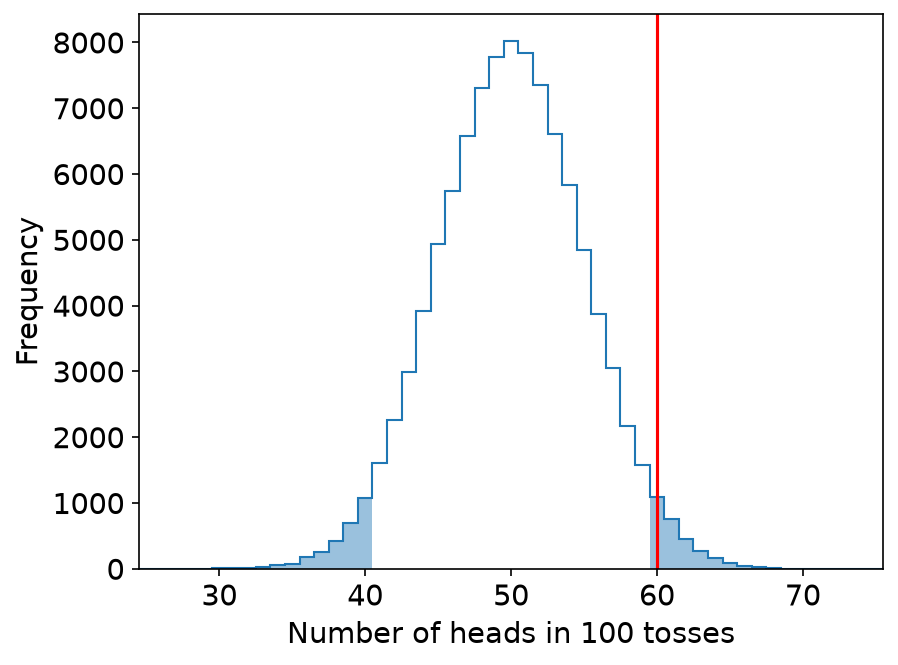
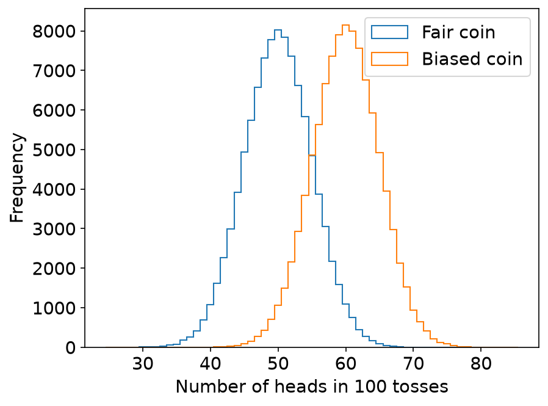

# Hypothesis testing

You have data, and you want to make a claim about it.
For example: the posts of one group of accounts are more positive than the posts of another group.
A hypothesis test tells you whether the data gives enough evidence for the claim.

A typical use in social media analysis is to compare two groups.
The same idea works for many other questions, such as an A/B test of a new feature.

The [Significance Tests notebook](significance-tests.ipynb) runs all the code on this page.
A comment after a line of code shows the result of that line, rounded.
The code uses these imports and figure settings.

```python
import matplotlib.pyplot as plt
import numpy as np
import scipy.stats
from statsmodels.stats.proportion import proportions_ztest

# Figure settings: a larger font, and tick marks drawn behind the data.
plt.rcParams.update({"font.size": 14, "axes.axisbelow": True})
```

## What a test answers

In most cases you do not have the data of the whole population.
You have a sample, and a sample is noisy.
A difference that you see in a sample can come from chance alone.

A test needs two terms.

- The **null hypothesis** is the claim that nothing is going on: no difference, no effect. It is often the opposite of the claim that you want to make.
- The **p-value** is the probability of getting a result at least as extreme as yours, if the null hypothesis is true.

A small p-value means that your result would be rare if the null hypothesis were true.
You then reject the null hypothesis, and the result is called statistically significant.
People often use 0.05 as the threshold: a result with p < 0.05 is significant.

Two readings of the p-value are wrong.

- The p-value is not the probability that the null hypothesis is true.
- A p-value above the threshold does not prove the null hypothesis. It only means that the data does not give enough evidence against it.

## One sample against a known value

You toss a coin 100 times and get 60 heads.
Is the coin biased?
A fair coin gives heads 50% of the time, but it can also give 60 heads by chance.
The question is how often that happens.

The null hypothesis is that the coin is fair.
To see what a fair coin does, simulate it.
One run is 100 tosses of a fair coin.
The code repeats the run 100,000 times and keeps the number of heads of each run.

```python
rng = np.random.default_rng(415)
# number of heads in each run of 100 tosses
fair_runs = rng.binomial(n=100, p=0.5, size=100_000)
```

You observed 60 heads.
That is 10 more than the 50 heads that a fair coin gives on average.
Count the fair runs that are at least that far from 50: the runs with 60 or more heads, and the runs with 40 or fewer.

```python
far = np.abs(fair_runs - 50) >= 10
far.mean()    # 0.05676
```

The share is 0.057, or 5.7% of the runs.
This share is the p-value: p = 0.057.

{ width="480" }

The red line is at the 60 heads that you observed.
The filled bars are the runs that are at least as far from 50.
Together they hold 5.7% of the runs.
The notebook has the code of the figure in the section [The p-value](significance-tests.ipynb#the-p-value).

p > 0.05, so you cannot reject the null hypothesis.
This does not prove that the coin is fair.
It means that 60 heads in 100 tosses is not enough evidence that the coin is biased.

## The binomial test

You do not need the simulation.
The binomial test computes the p-value directly.
Use it when each observation has one of two outcomes, and you compare the share of one outcome with a known value.

```python
scipy.stats.binomtest(60, n=100, p=0.5).pvalue    # 0.0569
scipy.stats.binomtest(600, n=1000, p=0.5).pvalue    # 2.7e-10
```

- The first line tests 60 heads in 100 tosses against a coin with a 50% chance of heads. The p-value is 0.0569, the same as the result of the simulation.
- The second line tests 600 heads in 1,000 tosses. The share of heads is the same, 60%, and the sample is 10 times as large. The p-value is 2.7e-10, which is 2.7 × 10^-10 and almost 0.

The amount of data matters as much as the size of the difference.

## A test can miss a real difference

Now suppose the coin is biased and gives heads 60% of the time.
Simulate 100,000 runs of 100 tosses with this coin.

```python
biased_runs = rng.binomial(n=100, p=0.6, size=100_000)
```

This line draws from the generator `rng` of the fair runs.
Run it right after the fair runs to get the numbers below.

{ width="480" }

The runs of the biased coin are centered at 60 heads.
The two distributions overlap a lot.
The notebook has the code of the figure in the section [A biased coin](significance-tests.ipynb#a-biased-coin).

Which results give p < 0.05?
The next code computes the p-value for 60 heads and for 61 heads from the fair runs.

```python
print((np.abs(fair_runs - 50) >= 10).mean())    # 60 heads
print((np.abs(fair_runs - 50) >= 11).mean())    # 61 heads
```

The p-value is 0.057 for 60 heads and 0.035 for 61 heads.
A run needs 61 or more heads to give p < 0.05.

```python
(biased_runs >= 61).mean()    # 0.462
```

Only 46% of the runs of the biased coin have 61 or more heads.
With one run of 100 tosses, the test misses the bias more than half of the time.
More tosses in each run make both distributions narrower, so the overlap gets smaller and the test misses the bias less often.

## Two groups: the t-test

A more typical question is whether two groups have different mean values.
The t-test answers this question.
Its null hypothesis is that the two groups have the same mean.

The example is two simulated groups of 200 heights each.
The heights of group A come from a normal distribution with a mean of 170 cm, and the heights of group B from one with a mean of 175 cm.
The standard deviation is 10 cm in both groups.

```python
rng = np.random.default_rng(2026)
group_a = rng.normal(loc=170, scale=10, size=200)    # heights in cm
group_b = rng.normal(loc=175, scale=10, size=200)

print(f"Mean of group A: {group_a.mean():.2f}")    # Mean of group A: 170.74
print(f"Mean of group B: {group_b.mean():.2f}")    # Mean of group B: 175.18
```

```python
scipy.stats.ttest_ind(group_a, group_b)    # statistic=-4.253, pvalue=2.6e-05, df=398.0
```

The test statistic is −4.253 and the p-value is 2.6e-05, with 398 degrees of freedom.
If the two groups had the same mean, a difference this large would be rare.
p < 0.05, so you reject the null hypothesis: the mean heights of the two groups are significantly different.

## Choosing a test

| Test | What it compares | What it assumes | Function |
|------|------------------|-----------------|----------|
| Binomial test | The share of one outcome in one sample, with a known value | Each observation has one of two outcomes | `scipy.stats.binomtest` |
| t-test | The means of two groups | The data follows a normal distribution | `scipy.stats.ttest_ind` |
| Mann–Whitney U test | Two groups: does one group tend to have larger values? | No normal distribution. It uses the ranks of the values | `scipy.stats.mannwhitneyu` |
| Kolmogorov–Smirnov (KS) test | Two samples: do they come from the same distribution? | No normal distribution. It uses the largest distance between the CDFs of the two samples | `scipy.stats.ks_2samp` |
| Two-proportions z-test | The shares (percentages) of one outcome in two groups | Each observation has one of two outcomes, and both samples are large | `proportions_ztest` in `statsmodels.stats.proportion` |

Every test in the table assumes that the observations are independent of each other.
`ttest_ind` also assumes by default that the two groups have the same variance; `equal_var=False` removes this assumption.

The t-test assumes that the data follows a normal distribution.
Much social media data does not: the number of followers is one example.
For such data, use a non-parametric test, which does not make this assumption.
The Mann–Whitney U test and the KS test are non-parametric.

The next two lines run both tests on the two groups of heights from the t-test.

```python
scipy.stats.mannwhitneyu(group_a, group_b)    # statistic=15252.0, pvalue=4.0e-05
```

```python
scipy.stats.ks_2samp(group_a, group_b)    # statistic=0.195, pvalue=0.00097
```

Both tests give p < 0.05, as the t-test does.

The two-proportions z-test compares two percentages.
In the example, one coin gives 60 heads in 100 tosses, and a second coin gives 45 heads in 100 tosses.
`proportions_ztest` takes the two counts and the two sample sizes.

```python
z_statistic, p_value = proportions_ztest(count=[60, 45], nobs=[100, 100])
print(f"z statistic: {z_statistic:.3f}")    # z statistic: 2.124
print(f"p-value: {p_value:.4f}")    # p-value: 0.0337
```

p < 0.05, so the difference between 60% and 45% is significant.

## Marking significance in a figure

A figure that compares groups often shows the result of each test as a mark between the two groups.

| Mark | Meaning |
|------|---------|
| `***` | p ≤ 0.001 |
| `**` | p ≤ 0.01 |
| `*` | p ≤ 0.05 |
| NS | p > 0.05, not significant |

For an example, see Figure 3 of [Yang, Ferrara, and Menczer (2022)](https://doi.org/10.1007/s42001-022-00177-5).
The marks on its box plots come from Mann–Whitney U tests, and the marks on its percentages come from two-proportions z-tests.

## Reporting a result

A report of a test has five steps.

1. State your hypothesis.
2. Describe how you will test it.
3. Run the test.
4. Report the p-value, and say whether you can reject the null hypothesis.
5. Say what the result means for your question.

Example: you want to claim that one group of accounts writes more toxic posts than another group.

- The null hypothesis is that the two groups do not differ in toxicity.
- You sample posts from both groups and compare the distributions of their toxicity scores with a test.
- The test gives p = 0.001. If the two groups did not differ, a difference at least this large would appear in only 0.1% of samples.
- You reject the null hypothesis: the two groups differ in toxicity.

The threshold 0.05 is a convention, and it is somewhat arbitrary.
Some researchers and journals require a smaller threshold, such as 0.01.
Report the p-value itself, not only whether the result is significant.
Readers can then decide for themselves.

## Significance and effect size

A result can be statistically significant and still too small to matter.

- With too few data points, a test cannot detect a real difference.
- With more data points, smaller differences become significant.
- With very many data points, which is typical for social media data, almost every difference is significant.

The example is a coin with a 51% chance of heads.
In the notebook section [Toss a coin 100,000 times](significance-tests.ipynb#toss-a-coin-100000-times), a simulation of this coin gave 51,148 heads in 100,000 tosses.
Test this result against a fair coin.

```python
result = scipy.stats.binomtest(51148, n=100_000, p=0.5)
print(f"p-value: {result.pvalue:.1e}")    # p-value: 3.9e-13
print(f"Share of heads: {51148 / 100_000:.1%}")    # Share of heads: 51.1%
```

The p-value is 3.9e-13, far below 0.001, so the difference from a fair coin is statistically significant.
The share of heads is 51.1%, which is about 1 percentage point above 50%.

Report the effect size as well: say how large the difference is, not only that it is significant.

## Further topics

This page does not cover the three topics below.
Each one has a link to start from.

- **Multiple comparisons.** When you run many tests on the same data, some of them give p < 0.05 by chance, so adjust the p-values with a method such as Bonferroni or Benjamini–Hochberg; see [`multipletests` in statsmodels](https://www.statsmodels.org/stable/generated/statsmodels.stats.multitest.multipletests.html).
- **Effect size measures.** A standardized measure such as Cohen's d states the size of a difference in units of the standard deviation, so that readers can compare it across studies; see [Lakens (2013)](https://doi.org/10.3389/fpsyg.2013.00863).
- **Chi-square test.** To test whether two categorical variables are related, for example the platform of a post and its label, count the posts in each combination and run a chi-square test of independence; see [`chi2_contingency` in SciPy](https://docs.scipy.org/doc/scipy/reference/generated/scipy.stats.chi2_contingency.html).

## Links

- [Significance Tests notebook](significance-tests.ipynb): all the code on this page
- The SciPy documentation of [`binomtest`](https://docs.scipy.org/doc/scipy/reference/generated/scipy.stats.binomtest.html), [`ttest_ind`](https://docs.scipy.org/doc/scipy/reference/generated/scipy.stats.ttest_ind.html), [`mannwhitneyu`](https://docs.scipy.org/doc/scipy/reference/generated/scipy.stats.mannwhitneyu.html), and [`ks_2samp`](https://docs.scipy.org/doc/scipy/reference/generated/scipy.stats.ks_2samp.html)
- The statsmodels documentation of [`proportions_ztest`](https://www.statsmodels.org/stable/generated/statsmodels.stats.proportion.proportions_ztest.html)
- Yang, Ferrara, and Menczer (2022), [Botometer 101: social bot practicum for computational social scientists](https://doi.org/10.1007/s42001-022-00177-5): Figure 3 marks significance with stars

Next: [Correlation](correlation.md) measures whether two values change together.
