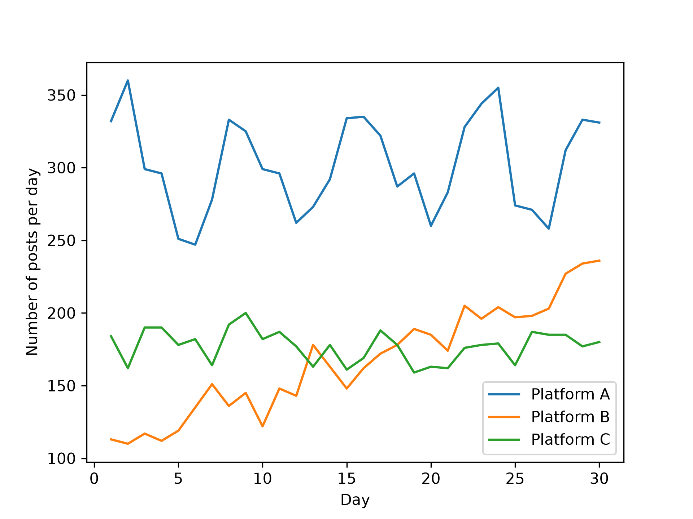
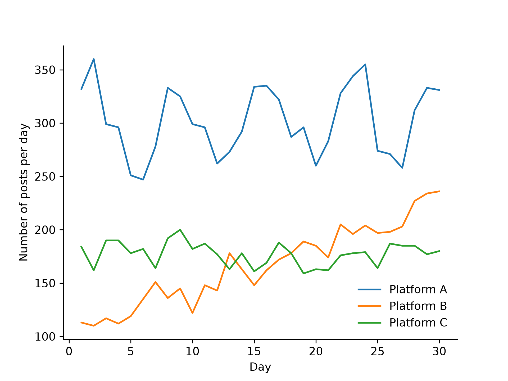
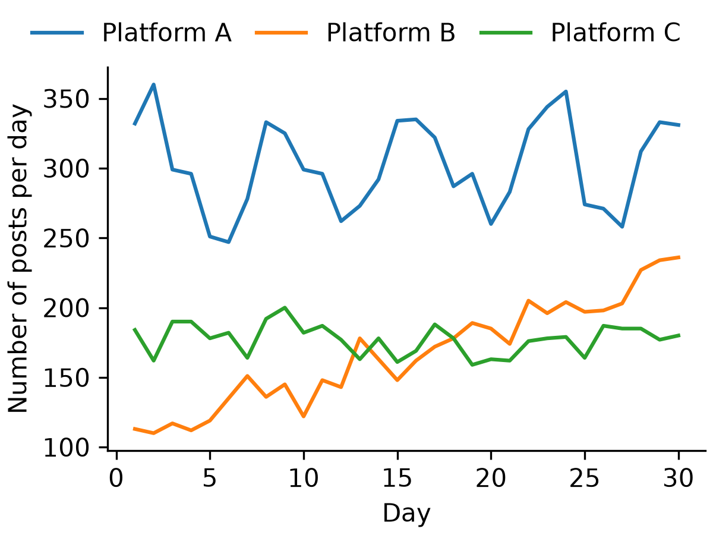

# Figure design principles

A figure in a report should be easy to read.
This page states five principles of figure design and applies them to one plot, step by step.

The worked example is "From a default plot to a figure for a report".
It starts with a plot that has the default settings of Matplotlib, and it ends with a PDF file and a PNG file for a report.
The data of the worked example is invented: the code generates the number of posts per day on three platforms, so the figure shows no real finding.

The [Figure for a Report notebook](report-figure.ipynb) runs all the code on this page.
A comment after a line of code shows the result of that line.
The code uses these imports.
Scicolor is a package of color maps for scientific figures.
Install it with `pip install scicolor`.

```python
import os

import matplotlib.pyplot as plt
import numpy as np
import pandas as pd
import scicolor
from IPython.display import Image, display
from matplotlib.colors import to_hex
```

## The principles

The goal is a figure that is easy to read.
Five principles help you to reach it.

1. [Think about your message](#think-about-your-message)
2. [Always label your figures](#always-label-your-figures)
3. [Keep it simple](#keep-it-simple)
4. [Make the fonts readable](#make-the-fonts-readable)
5. [Use vector or high-resolution files](#use-vector-or-high-resolution-files)

The worked example has one more step, on color, before the last principle: [Choose colors that every reader can tell apart](#choose-colors-that-every-reader-can-tell-apart).

## Think about your message

Write the message of the figure as one sentence before you make the figure.
The message is what the reader should remember.
Then choose the figure type, the order of the items, and the colors that make this sentence easy to see.

The message of the worked example: **Platform B grew during the 30 days and passed platform C. Platform A and platform C did not grow.**

The message is about a change over time, so the figure is a line plot with one line for each platform.

## The default plot

The code below generates the data.
The post counts are invented.
The seed 415 makes the random numbers the same in every run.

```python
# Invented data: the number of posts per day on three platforms for 30 days.
rng = np.random.default_rng(415)
day = np.arange(1, 31)
posts = pd.DataFrame({
    "day": day,
    "platform_a": 300 + 40 * np.sin(2 * np.pi * day / 7) + rng.normal(0, 15, size=30),
    "platform_b": 100 + 4 * day + rng.normal(0, 12, size=30),
    "platform_c": 180 + rng.normal(0, 12, size=30),
}).round().astype(int)
posts.head()
```

The table has 30 rows, one for each day, and 4 columns.
Each platform column holds the number of posts on that day.

| | day | platform_a | platform_b | platform_c |
|---|---|---|---|---|
| 0 | 1 | 332 | 113 | 184 |
| 1 | 2 | 360 | 110 | 162 |
| 2 | 3 | 299 | 117 | 190 |
| 3 | 4 | 296 | 112 | 190 |
| 4 | 5 | 251 | 119 | 178 |

The first plot uses the default settings of Matplotlib.
`label=column` gives each line its column name as the legend entry.

```python
fig, ax = plt.subplots()
for column in ["platform_a", "platform_b", "platform_c"]:
    ax.plot(posts["day"], posts[column], label=column)
ax.legend()
plt.show()
```

{ width="640" }

The plot shows the three lines, and the reader still misses several things.

- The axes have no labels, so the reader does not know what the numbers are.
- The legend shows the column names of the table, such as `platform_a`. A column name is written for code, not for a reader.

The five steps below fix these two points and several others.

## Always label your figures

A figure needs labels.

- Give each axis a label, and include the unit.
- Write the legend entries in plain words.
- Add an annotation where it helps the reader, for example a note next to an important point.

A figure in a report also needs a caption.

Step 1 of the worked example adds the two axis labels and replaces the column names in the legend.
The `label` argument of `ax.plot` sets the legend entry of a line.

```python
labels = {"platform_a": "Platform A", "platform_b": "Platform B", "platform_c": "Platform C"}

fig, ax = plt.subplots()
for column, label in labels.items():
    ax.plot(posts["day"], posts[column], label=label)
ax.set_xlabel("Day")
ax.set_ylabel("Number of posts per day")
ax.legend()
plt.show()
```

{ width="640" }

The y-axis label says what is counted and for which period: posts per day.

The caption is part of the text of the report and not part of the figure.
For this reason the figure has no title: a title would repeat the caption.

## Keep it simple

Include only the elements that the message needs.
Every extra element takes attention away from the data.

Step 2 removes three elements that carry no information: the top border of the plot, the right border, and the frame around the legend.
`ax.spines` holds the four borders of the plot.

```python
fig, ax = plt.subplots()
for column, label in labels.items():
    ax.plot(posts["day"], posts[column], label=label)
ax.set_xlabel("Day")
ax.set_ylabel("Number of posts per day")
ax.spines[["top", "right"]].set_visible(False)
ax.legend(frameon=False)
plt.show()
```

{ width="640" }

The left border and the bottom border stay, because they carry the tick marks and the numbers.

## Make the fonts readable

The text in a figure should be as large as the text around the figure, or larger.
The text gets too small when a large figure is shrunk to fit the page.

1. Create the figure in the size that it has in the report.
2. Then set the font size.

The figure of step 2 has the default size of Matplotlib: 6.4 inches wide and 4.8 inches high.
Suppose that the figure is 4 inches wide in the report and that the text of the report has 10 points.

The next code saves the figure of step 2 as it is, for a comparison below.

```python
os.makedirs("output", exist_ok=True)
# The figure of step 2 has the default size, 6.4 by 4.8 inches.
fig.savefig("output/step2.png", dpi=300)
```

Step 3 draws the figure again with a size of 4 by 3 inches and saves it too.
`figsize` is in inches, and `font.size` is in points.

```python
plt.rcParams["font.size"] = 10
fig, ax = plt.subplots(figsize=(4, 3), layout="constrained")
for column, label in labels.items():
    ax.plot(posts["day"], posts[column], label=label)
ax.set_xlabel("Day")
ax.set_ylabel("Number of posts per day")
ax.spines[["top", "right"]].set_visible(False)
fig.legend(frameon=False, loc="outside upper center", ncols=3, columnspacing=1)
fig.savefig("output/step3.png", dpi=300)
plt.show()
```

The default font size of Matplotlib is also 10 points, so the first line changes nothing here.
Change the number if the text of your report has another size.

The code has two more changes, and both come from the smaller size.

- `layout="constrained"` tells Matplotlib to move the plot so that the labels fit inside the figure. Without it, most of the x-axis label of a figure of this size is below the lower edge of the saved file.
- The legend is above the plot, in one row. In a figure of this size, a legend inside the plot covers a part of the lines. `fig.legend` with `loc="outside upper center"` puts the legend above the plot, and the constrained layout makes room for it. `ncols=3` puts the three entries in one row. `columnspacing=1` moves the entries closer together, so that the row fits into 4 inches.

In a notebook, the next code shows both saved files with a width of 400 pixels.
This is how they compare when both are 4 inches wide in a report.

```python
# Both files, as wide as they are in the report (400 pixels stand for 4 inches).
display(Image("output/step2.png", width=400))
display(Image("output/step3.png", width=400))
```

The first image is the figure of step 2.
It was made 6.4 inches wide, so it is shrunk to fit a width of 4 inches.

{ width="400" }

Its 10-point text becomes 6.25-point text (10 × 4 / 6.4), which is much smaller than the text of the report.
Its lines get thinner too.

The second image is the figure of step 3.
It was made 4 inches wide, so its text stays at 10 points.

{ width="400" }

If your code calls `sns.set_theme()`, seaborn sets its own font sizes, and `plt.rcParams["font.size"]` no longer changes the axis labels and the tick labels.
Pass the sizes to seaborn instead: `sns.set_theme(rc={"font.size": 10, "axes.labelsize": 10, "axes.titlesize": 10, "xtick.labelsize": 10, "ytick.labelsize": 10, "legend.fontsize": 10})`.

## Choose colors that every reader can tell apart

Some readers have a color-vision deficiency, and some reports are printed in black and white.
Take the colors of a figure from a color-blind friendly color map, and check each color against the background of the figure.
The page [Color](color.md) covers how to choose and check a color map.

Step 4 takes the colors from `Archambault`.
It is a categorical color map of the Scicolor package: a list of colors for groups that have no order.
The next code shows its seven colors as hex codes.

```python
cmap = scicolor.get_cmap("Archambault")
[to_hex(cmap(i)) for i in range(7)]
# ['#88a0dc', '#381a61', '#7c4b73', '#ed968c', '#ab3329', '#e78429', '#f9d14a']
```

The seven colors are a light blue, a dark purple, a muted purple, a pink, a red, an orange, and a yellow.
A thin line in yellow is hard to see on a white background, so the figure does not use the last color.
The figure uses the dark purple, the red, and the orange: one dark color, one medium color, and one light color.

```python
colors = {"platform_a": cmap(4), "platform_b": cmap(1), "platform_c": cmap(5)}

fig, ax = plt.subplots(figsize=(4, 3), layout="constrained")
for column, label in labels.items():
    ax.plot(posts["day"], posts[column], label=label, color=colors[column])
ax.set_xlabel("Day")
ax.set_ylabel("Number of posts per day")
ax.spines[["top", "right"]].set_visible(False)
fig.legend(frameon=False, loc="outside upper center", ncols=3, columnspacing=1)
plt.show()
```

{ width="400" }

Platform B has the darkest color, because the message is about platform B.
The lines of platform B and platform C cross, so they have the darkest and the lightest of the three colors: the dark purple and the orange.
The three colors differ in lightness, so the three lines stay different in a black and white print.

## Use vector or high-resolution files

A figure file is a raster file or a vector file.

- A raster file, such as a PNG or a JPEG file, stores pixels. It gets blurred when it is enlarged.
- A vector file, such as a PDF or an SVG file, stores shapes. It stays sharp at every size.

Prefer a vector file for a report.
If you need a raster file, save it with 300 DPI (dots per inch).

Step 5 saves the figure of step 4 as a PDF file and as a PNG file.

```python
fig.savefig("output/figure.pdf")
fig.savefig("output/figure.png", dpi=300)
```

The code writes two files into the folder `output`.
The PDF file has one page of 4 by 3 inches.
The PNG file has 1200 by 900 pixels, which is 4 by 3 inches at 300 DPI.
`savefig` chooses the file type from the end of the file name, so the name `figure.svg` gives an SVG file.

Two notes on `savefig`:

- In a notebook, `fig.savefig` works in a later cell, because the name `fig` still refers to the figure of step 4. `plt.savefig` in a cell of its own saves an empty figure, because the notebook closes each figure at the end of the cell that draws it. In the cell that draws the figure, and in a script, both forms work.
- The calls have no `bbox_inches="tight"` argument. That argument crops the file to its content, so the file is no longer 4 by 3 inches.

## The complete code

The code below has the data, the final figure, and the export in one place.
It runs on its own, so you can copy it into a script.
In your own figure, replace the data, the labels, the size, and the file names.

```python
import os

import matplotlib.pyplot as plt
import numpy as np
import pandas as pd
import scicolor

# Invented data: the number of posts per day on three platforms for 30 days.
rng = np.random.default_rng(415)
day = np.arange(1, 31)
posts = pd.DataFrame({
    "day": day,
    "platform_a": 300 + 40 * np.sin(2 * np.pi * day / 7) + rng.normal(0, 15, size=30),
    "platform_b": 100 + 4 * day + rng.normal(0, 12, size=30),
    "platform_c": 180 + rng.normal(0, 12, size=30),
}).round().astype(int)

labels = {"platform_a": "Platform A", "platform_b": "Platform B", "platform_c": "Platform C"}
cmap = scicolor.get_cmap("Archambault")
colors = {"platform_a": cmap(4), "platform_b": cmap(1), "platform_c": cmap(5)}

plt.rcParams["font.size"] = 10
fig, ax = plt.subplots(figsize=(4, 3), layout="constrained")
for column, label in labels.items():
    ax.plot(posts["day"], posts[column], label=label, color=colors[column])
ax.set_xlabel("Day")
ax.set_ylabel("Number of posts per day")
ax.spines[["top", "right"]].set_visible(False)
fig.legend(frameon=False, loc="outside upper center", ncols=3, columnspacing=1)

os.makedirs("output", exist_ok=True)
fig.savefig("output/figure.pdf")
fig.savefig("output/figure.png", dpi=300)
plt.show()
```

The two `savefig` lines are in the code that draws the figure, before `plt.show()`.

## Links

- [Figure for a Report notebook](report-figure.ipynb): all the code on this page
- The Matplotlib documentation of [`savefig`](https://matplotlib.org/stable/api/_as_gen/matplotlib.pyplot.savefig.html)
- The Matplotlib guides on [the runtime settings (`rcParams`)](https://matplotlib.org/stable/users/explain/customizing.html), on [the legend](https://matplotlib.org/stable/users/explain/axes/legend_guide.html), and on [the constrained layout](https://matplotlib.org/stable/users/explain/axes/constrainedlayout_guide.html)
- [Scicolor](https://pypi.org/project/scicolor/): the package with the color map `Archambault`
- Rougier, Droettboom, and Bourne (2014), [Ten Simple Rules for Better Figures](https://doi.org/10.1371/journal.pcbi.1003833)

Next: [Color](color.md) covers how to choose and check a color map.
